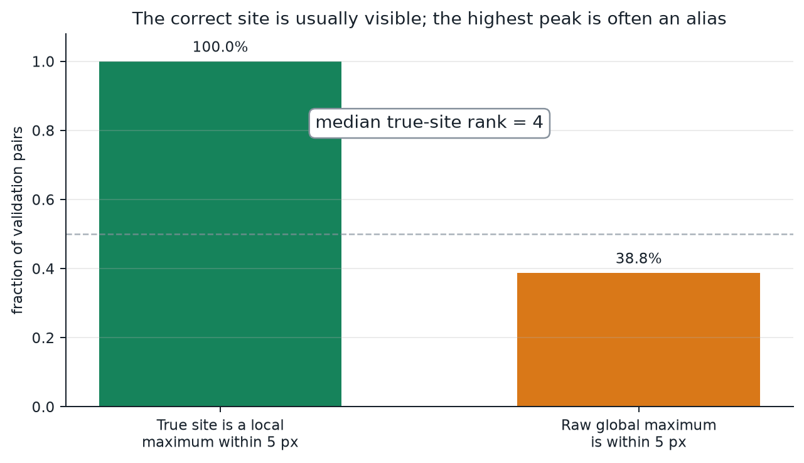

# LatticeRank — Periodic-Aware Localization for Wafer Inspection

LatticeRank finds a high-magnification Reference field inside a Search image
covering ten times the physical area. Both images are 1,000 × 1,000 pixels. The
output is one Search-image coordinate: `(x, y)`.

The difficult part is not finding a strong match. It is choosing the correct
physical copy when a DRAM or FinFET layout repeats across the image.

**Naming:** LatticeRank is the localization product and release. `driftforge`
is its importable Python package and synthetic-data subsystem. The packaged
`hgb_r2.joblib` filename is an internal ranker artifact, not a second product
version.


## Judge it in sixty seconds

After installing the pinned Python 3.12 environment, one read-only command
loads the bundled model, runs both architectures from outside the repository
directory, and checks the exact stdout contract:

```bash
python scripts/judge_check.py
```

Then recompute every headline rate from the emitted coordinates—not from this
README:

```bash
python scripts/verify_evidence.py
```

For a one-page compliance handoff, open the
[submission sheet](SUBMISSION.md). For the narrated path, use the
[five-minute judge demonstration](docs/FIVE_MINUTE_DEMO.md). For immediate
inspection: [method](docs/METHOD.md) · [results](docs/RESULTS.md) ·
[failure analysis](docs/FAILURE_ANALYSIS.md) ·
[public-field review](docs/COMPETITIVE_REVIEW.md) ·
[parameter-to-citation matrix](docs/REFERENCES.md).

## Results at a glance

LatticeRank clears 90% on a pinned public reference-style generator, but not
on its much broader internal stress generator. Both outcomes are first-class
results because they answer different questions.

| Benchmark | Protocol | ≤5 px | >25 px | Median error |
|---|---|---:|---:|---:|
| External development | 4 seeds × 30 pairs | **93.33% (112/120)** | 6.67% | 1.44 px |
| External untouched confirmation | seed 4700 × 30 pairs | **100.00% (30/30)** | 0.00% | 1.46 px |
| Internal fixed stress | 80 scene-disjoint pairs | 48.75% (39/80) | 51.25% | 62.57 px |
| Internal randomized compliance | seed 2026 × 40 pairs | 55.00% (22/40) | 45.00% | 4.36 px |

The external benchmark is the public
[`FlankerDev12/drift-sense-ref`](https://github.com/FlankerDev12/drift-sense-ref)
generator pinned at commit `5937638`. Seeds 4200–4600 were used while freezing
the consensus equation; seed 4700 was held back for confirmation. The exact
generator hashes, selection equation, 150 final coordinates, and split labels
are committed in [external benchmark metrics](results/external_starter_benchmark.json)
and [row evidence](results/external_starter_predictions.csv).


## The story in three observations

### 1. The true site is usually visible

On the fixed 80-pair, leak-free validation split, a raw-correlation local
maximum lands within 5 pixels of ground truth in **100%** of cases. Yet the
global maximum is correct in only **38.75%**, and the median true-site rank is
4. The signal survives; a periodic alias often scores slightly
higher.



This diagnostic is recorded in
[`results/visibility_diagnostic.json`](results/visibility_diagnostic.json).
It is not final localization accuracy.

### 2. Candidate harvesting recovers most true sites

LatticeRank combines raw-intensity, mid-band, and directionality correlation
maps. The shipped `δ=0.10` pool contains a candidate within 5 pixels in
**90.0%** of cases. A wider `δ=0.15` diagnostic reaches **92.5%**
(**97.4% DRAM / 87.8% FinFET**) at the cost of many more candidates.


Candidate recall answers “did the correct site enter the pool?” It does not
answer “did the system select it?”

### 3. Ranking periodic copies is distribution-dependent

The packaged HGB ranker, structural descriptor, periodic-residual evidence,
and explicit low-context wallpaper rule produce **48.75% final localization
accuracy within 5 pixels** on the same 80 pairs. The catastrophic error rate
(>25 px) is **51.25%**. Most remaining large errors are distant lattice copies,
not near misses. On the pinned external generator, the same production
consensus reaches **93.33%** during development and **100.0%** on the untouched
30-pair confirmation seed.

| Measurement | Result |
|---|---:|
| True site is a raw local maximum within 5 px | 100.0% |
| Shipped candidate recall within 5 px (`δ=0.10`) | 90.0% |
| Wider-pool diagnostic recall (`δ=0.15`) | 92.5% |
| Final localization within 5 px | **48.75%** |
| Final DRAM / FinFET localization within 5 px | 51.3% / 46.3% |
| Final catastrophic error rate (>25 px) | 51.25% |

That internal headline is 39 successes out of 80; its 95% Wilson interval is
**38.1%–59.5%**. It is evidence about this synthetic benchmark, not a promise
of the same rate on an unseen microscope or process node.

The seven fixed exact-wallpaper cases improve from 0/7 to **7/7 within 5 px**.
Their inference path falls to about one second because noise-driven score
differences are ignored before the expensive descriptor. This resolves the
defined non-identifiable subgroup; it does not solve ordinary remote-alias
ranking.

Evidence: [metrics](results/validation_metrics.json),
[predictions](results/validation_predictions.csv),
[candidate recall](results/candidate_recall.json), and
[claim provenance](results/claim_provenance.json).

## One success and one honest failure

The success below is a measured DRAM hard-profile case with 0.06 px error.


The failure is a measured FinFET case. A plausible periodic copy outranks the
true site and moves the prediction 256.75 px away.


The point of showing both is simple: the system is often precise when it picks
the right copy, but it does not yet pick the right copy reliably enough.

## How inference works

```text
Reference + Search
        |
        v
10:1 scale normalization + three correlation channels
        |
        v
adaptive local-maximum harvesting
        |
        v
scene-relative + spatial correspondence features
        |
        v
HGB ranker + periodic-residual evidence
        |
        v
evidence-equivalent centre tie-break
        |
        v
      (x, y)
```

Distance to the Search centre is not a learned feature. Ordinary scenes use it
only after evidence defines a narrow equivalence set; detected exact wallpaper
uses the challenge's centre convention directly. See [Method](docs/METHOD.md).

The numerical path is compact:

1. Anti-alias and reduce the complete Reference by the known 10:1 pixel ratio,
   producing a Search-scale template `T`.
2. For channel `c`, evaluate zero-mean normalized cross-correlation
   `ρ_c(x,y) = <S_xy-μ_xy, T_c-μ_T> / (||S_xy-μ_xy|| ||T_c-μ_T||)`.
3. Form the adaptive pool
   `C = ⋃c localmax(ρ_c ≥ max(ρ_c) − δ)`, with shipped `δ=0.10`.
4. In the validated device-pitch envelope, use the frozen consensus
   `s_i = z(r_residual,i) + 0.05z(r_raw,i) + 0.05z(r_mid,i)` and a 0.025
   evidence-equivalence margin. Broader geometry falls back to
   `z(p_HGB,i) + z(r_residual,i)` with margin 0.05.
5. When at least 2,500 peaks, low coarse context, and low long-context decay
   identify exact wallpaper,
   the image contains no defensible evidence for one periodic copy. The
   pipeline applies the challenge convention directly and returns Search
   centre, skipping 77-feature description and residual matching.


Every panel above is regenerated from `validation-000240`; it is not a mock-up.

The two figures below open the numerical black box. The first shows the actual
periodic estimate, signed residual, and uniqueness mask. The second places all
five measured candidates in Search and plots every term in the frozen
consensus equation. Candidate errors appear only as post-evaluation labels;
ground truth is never an inference feature.


## Run a real inference

Python 3.12+ is required.

`requirements.txt` is the complete pinned competition freeze.
`requirements-runtime.txt` is the smaller direct inference set, and
`requirements-dev.txt` points to the full test/figure/build environment. The
judge path intentionally uses the complete freeze.

POSIX:

```bash
git clone https://github.com/RHUDHRESH/LatticeRank-SEMICON-2026.git
cd LatticeRank-SEMICON-2026
python -m venv .venv
source .venv/bin/activate
python -m pip install --disable-pip-version-check -r requirements.txt
python scripts/inference.py examples/dram/reference.png examples/dram/search.png
```

PowerShell:

```powershell
git clone https://github.com/RHUDHRESH/LatticeRank-SEMICON-2026.git
Set-Location LatticeRank-SEMICON-2026
py -m venv .venv
.\.venv\Scripts\Activate.ps1
python -m pip install --disable-pip-version-check -r requirements.txt
python scripts\inference.py examples\dram\reference.png examples\dram\search.png
```

Normal stdout is exactly one coordinate line:

```text
(644.50, 283.50)
```

Use `--json` to inspect candidate count, model provenance, residual use, and
the equivalence-set size. Errors and nonessential progress go to stderr.

## Generate your own DRAM or FinFET pairs

```bash
python scripts/generate_dataset.py --architecture DRAM --count 30 --output-dir generated/dram
python scripts/generate_dataset.py --architecture FinFET --count 30 --output-dir generated/finfet
```

Each pair contains independent Reference/Search acquisition noise, the images,
seed and scene provenance, and the true centre in both CSV and JSON form. The
generator is deterministic for a fixed seed and is a **synthetic SEM-like
acquisition model**, not a claim of fab-level physical fidelity. See
[Data generator](docs/DATA_GENERATOR.md) and
[References](docs/REFERENCES.md).

## Reproduce the measurements

Fixed 80-pair validation:

```bash
python scripts/evaluate.py validation --output-dir results/reproduced-validation
```

Independent randomized compliance evaluation (minimum 30 pairs):

```bash
python scripts/evaluate.py randomized --count 40 --seed 2026 --output-dir results/randomized-evaluation
```

That independent 40-pair run measured **55.0% within 5 px** (22/40; 95%
Wilson interval 39.8%–69.3%), **85.0% candidate-pool recall**, and **45.0%
catastrophic errors**. It supports the same diagnosis as the fixed split while
remaining a separate result. See the [30+ evaluation](results/evaluation_30plus.json)
and its [row evidence](results/evaluation_30plus_predictions.csv).

Reproduce the pinned external confirmation benchmark from a checkout of the
named source:

```bash
python scripts/evaluate_external_starter.py /path/to/drift-sense-ref \
  --count 30 --seed 4700 --output reproduced-external-4700.json
```

The release does not call this repository the official generator. It is a
public reference-style scaffold with a pinned revision and auditable presets.
That wording matters.

Regenerate every reviewer figure and both compact examples:

```bash
python scripts/make_figures.py
```

Reproduce the candidate-margin curve independently of the final ranker:

```bash
python scripts/evaluate_candidate_recall.py --output reproduced-candidate-recall.json
```

The one-pair public inference smoke on `examples/dram` took **3.6 seconds** on
the recorded Windows/Python 3.12 host. This is a single-pair measurement, not
an 80-pair mean. In the full production rerun, inference had a **2.86 s
median**, **6.15 s mean**, and **30.32 s P95** per pair; highly repetitive
scenes create much larger candidate pools and the long runtime tail. See
[runtime provenance](results/runtime.json) and the
[validation metrics](results/validation_metrics.json).

## Limitations

- Validation is synthetic-only; no sponsor SEM test pairs were available.
- Candidate discrimination remains the central unsolved problem.
- The wallpaper rule fixes 7/7 fixed exact cases, but its conservative
  image-derived detector can still miss heavily distorted wallpaper scenes.
- FinFET remains harder than DRAM in both candidate coverage and final selection.
- The fixed validation split has only 80 pairs, so subgroup estimates are
  uncertain.
- The procedural acquisition model is deliberately broader than a single
  process node and is not calibrated to a proprietary instrument.
- DRAM and FinFET currently share one orthogonal-line rendering primitive;
  sponsor-aligned full-contact and localized-gate presets still require a
  retrain and generator-family holdout.

Read [Results](docs/RESULTS.md) and
[Failure analysis](docs/FAILURE_ANALYSIS.md) before citing performance.

## Scientific process, including negative results

The project deliberately records experiments that looked promising and were
rejected. A nonlinear eleven-signal fusion reached 92.5% on its tuning half,
then collapsed to 27.5% on the untouched half. Fresh HGB retraining,
scene-group normalization, a 25-transform baseline, and 256/1,024-candidate
shortlists also failed their holdout or recall gates. None was promoted.

The complete experiment ledger is
[`results/optimization_experiments.json`](results/optimization_experiments.json).
A review of 208 public search results, five strong algorithmic references, and
the six competitor-inspired experiments that did not clear LatticeRank's
holdout gates is in the [public-field review](docs/COMPETITIVE_REVIEW.md).
A second unseen randomized seed measured 42.5% final accuracy despite 90.0%
candidate recall. The current canonical internal runs measure 48.75% and
55.0%; the external generator measures 93.33% development and 100.0%
confirmation. The release never merges those distributions into one score.

## Repository map

| Path | Role |
|---|---|
| `scripts/inference.py` | Two image paths in; one `(x, y)` out |
| `scripts/generate_dataset.py` | Standalone DRAM / FinFET pair generator |
| `scripts/train_ranker.py` | Scene-disjoint HGB training entry point |
| `scripts/evaluate.py` | Fixed and randomized end-to-end evaluation |
| `scripts/evaluate_candidate_recall.py` | Reproducible adaptive-pool sweep |
| `scripts/evaluate_visibility.py` | Reproducible raw-response rank diagnostic |
| `scripts/evaluate_external_starter.py` | Pinned external-generator harness |
| `scripts/aggregate_external_benchmark.py` | Freeze production selection from candidate traces |
| `scripts/judge_check.py` | Cross-platform, outside-CWD release smoke gate |
| `scripts/verify_evidence.py` | Recompute claims from final coordinates |
| `scripts/make_figures.py` | Evidence-backed figures and compact examples |
| `driftforge/models/hgb_r2.joblib` | Automatically loaded ranker weights |
| `SUBMISSION.md` | Official-requirement matrix and copy/paste judge path |
| `docs/` | Method, generator, results, failures, and references |
| `results/` | Claim provenance, metrics, and row-level predictions |
| `examples/` | One deterministic DRAM pair and one FinFET pair |
| `tests/` | Generator, leakage, inference, training, and packaging gates |
