# LatticeRank

Periodic-aware registration for semiconductor wafer inspection.

**Phase 2 (this submission)** locates a 1000×1000 reference field inside a
1000×1000 search image when zoom, rotation, and presence are all unknown. It
writes one CSV row per pair: `(x, y, theta, scale, found, score)`.

**Phase 1** was the same matcher with a known 10× scale, translation only, and
the reference always present. [V1 versus V2, with charts](docs/V1_VS_V2.md).

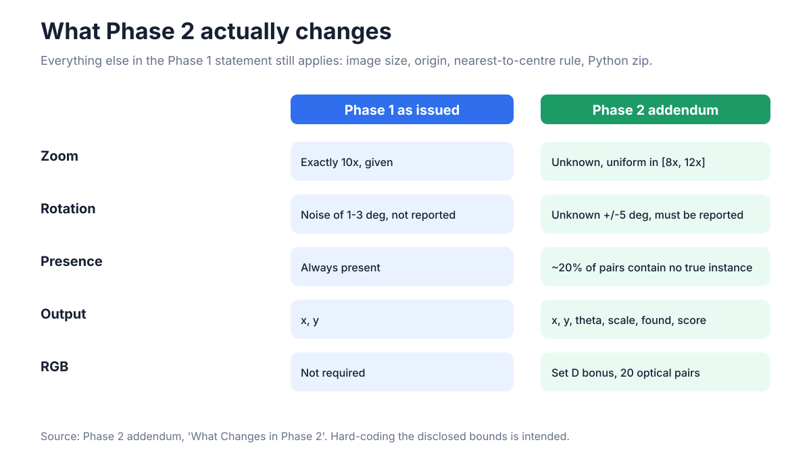

---

## Jury run (exact addendum signature)

```bash
python -m pip install --disable-pip-version-check -r requirements.txt
python register.py --input pairs.csv --output predictions.csv
```

Python 3.11, CPU only, no network, no GPU. Weights are already in
`driftforge/models/`. Nothing is downloaded at run time.

Full run sheet: [docs/HOW_TO_RUN.md](docs/HOW_TO_RUN.md).

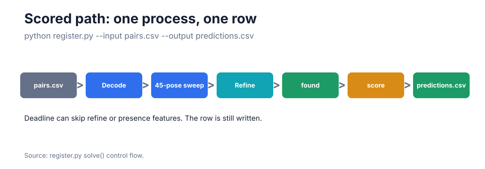

### Input

Organizer `pairs.csv`:

```csv
pair_id,search_path,reference_path
p001,search/p001.png,reference/p001.png
```

Image paths may be relative to the CSV, relative to `register.py`, or
absolute. RGB Set D frames are decoded to grayscale automatically.

Smoke on the two shipped examples:

```bash
python register.py --input examples/pairs.csv --output predictions.csv
```

### Output

```csv
pair_id,x,y,theta,scale,found,score
```

| Column | Contract |
|---|---|
| `x`, `y` | match centre in search pixels, origin top-left, subpixel allowed |
| `theta` | degrees, **CCW positive**, about the match centre |
| `scale` | down-scaling factor, reported in `[8, 12]` — not `1/s` |
| `found` | `1` or `0`; when `0`, the four pose columns are `0` |
| `score` | P(reported coordinate is correct), monotone in `[0, 1]` |

Every input `pair_id` appears **exactly once**. A missing row scores zero, so
failures still emit a row. An internal error is never written as a confident
rejection.

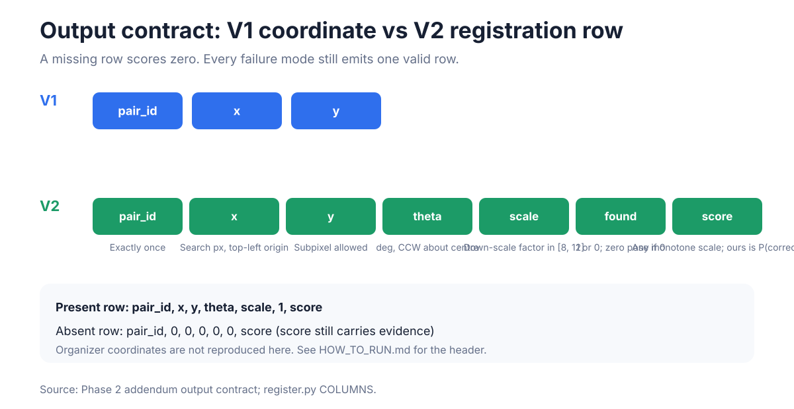

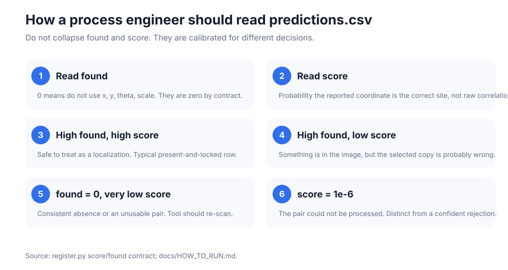

`found` and `score` are different questions. A reference can be present while
the selected lattice copy is wrong: `found = 1` and a low `score` is then the
correct report.

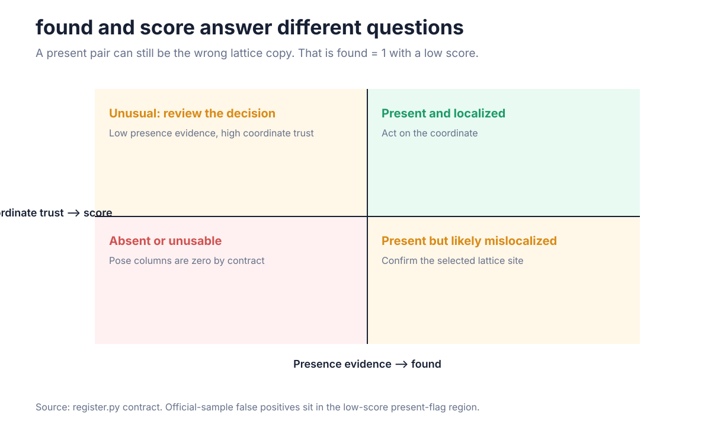

---

## What is in the zip

The addendum names four deliverables. They are all at zip root or one obvious
path away.

| Required | Where |
|---|---|
| `python register.py --input pairs.csv --output predictions.csv` | `register.py` |
| `requirements.txt` from `pip freeze` | `requirements.txt` |
| documented generator | `generate_dataset.py` (wrapper) and `scripts/generate_dataset.py` |
| `failure_analysis.pdf`, max 2 pages | `docs/failure_analysis.pdf` |
| weights inside the zip | `driftforge/models/*.pkl`, `*.joblib` |

Also included: this README, [HOW_TO_RUN](docs/HOW_TO_RUN.md),
[V1 vs V2](docs/V1_VS_V2.md), [citations](docs/REFERENCES.md), the
[failure analysis](docs/failure_analysis.md), tests, and the two example
pairs.

---

## Official sample result

The only evaluation in this repository on **organizer-generated data**: the
20-pair Phase 2 sample (8 Set A, 6 Set B, 4 Set C absent, 2 Set D RGB). Run
once, after the solver was frozen, with the shipped `register.py`, scored with
the published rubric. Nothing was tuned on it.

| Block | Result | Score |
|---|---|---:|
| Localization | Set A 0.975 · Set B 0.967 · Set D 1.000 | **38.82 / 40** |
| Pose (gated on localization) | mean credit 0.8656 | **17.31 / 20** |
| Rejection | F1 0.9412 (TP 16, FP 2, FN 0) | **14.12 / 15** |
| Confidence | AUC 0.8889 of `score` vs correctness | **8.89 / 10** |
| RGB bonus | Set D 1.000 with A–C 0.9704 | **+6** |
| Rejection-F1 bonus | F1 ≥ 0.90 | **+4** |

Scored subtotal: **79.14 / 85**, before bonuses.

Evidence:
[official sample evaluation](results/phase2_experiments/official_sample_evaluation.json).

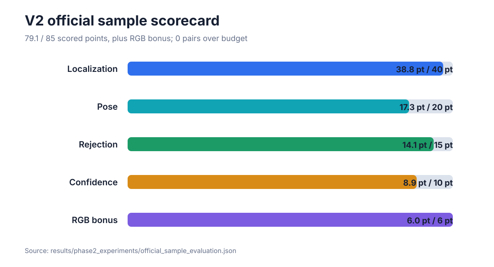

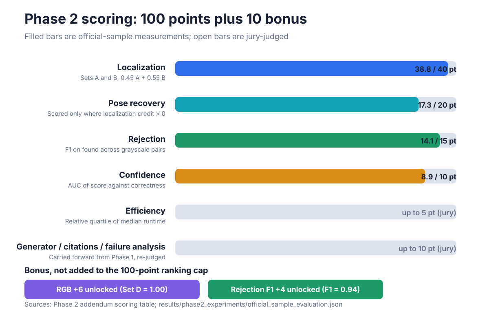

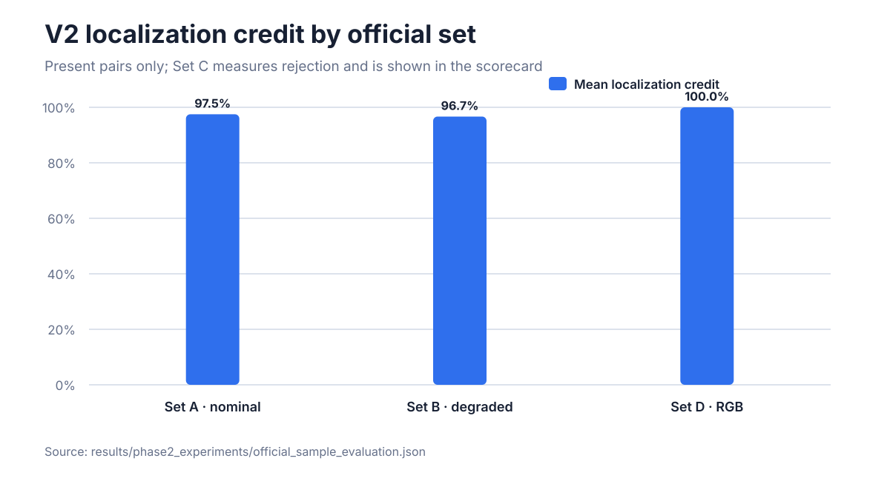

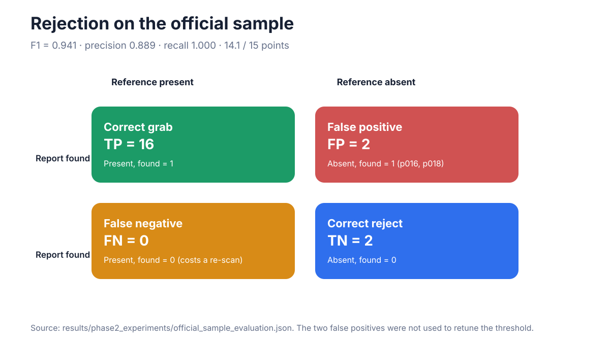

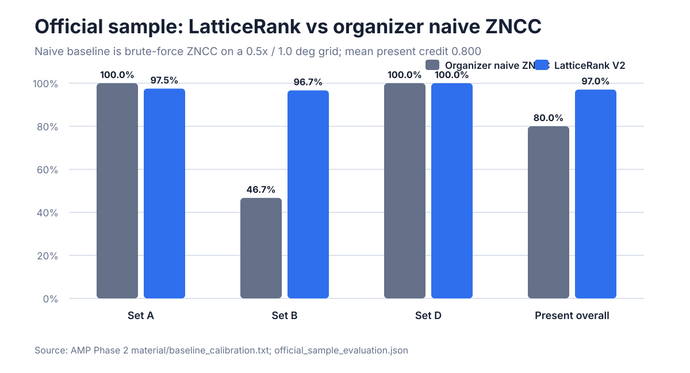

The organizers' own naive ZNCC baseline scores **0.800** mean credit on the
same present pairs, and scores 0 on the three hardest Set B pairs. LatticeRank
scores 1.00 on each of those three.

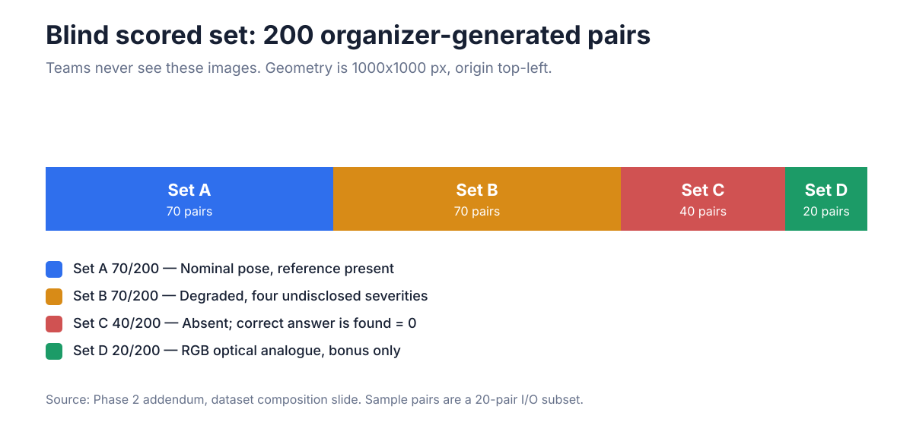

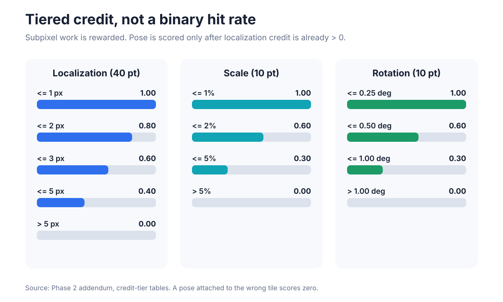

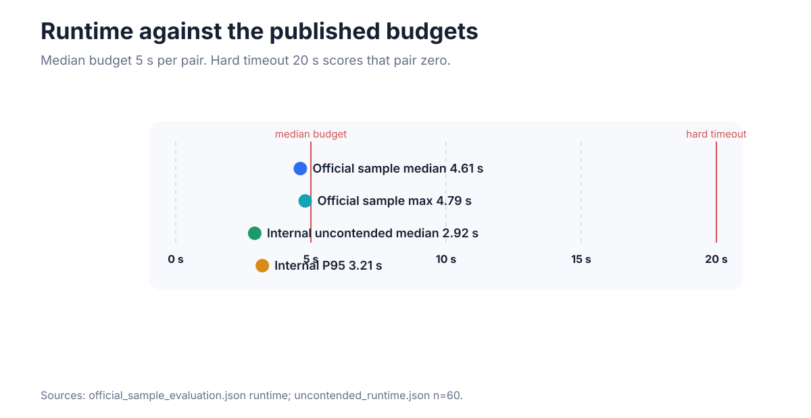

Official-sample wall clock: **median 4.61 s, max 4.79 s**, 0 pairs over
budget. Uncontended internal timing (n=60, 4 threads): **median 2.92 s,
P95 3.21 s**. Hard timeout is 20 s.

**Numbers below this line are not the scored task.** They come from our own
generator, which renders reference and search as independent acquisitions.
The organizer sample cuts the reference from the search canvas. Those
internal figures read ~30% where the official sample reads ~98%, and they
are a robustness stress-test. Details:
[docs/failure_analysis.md](docs/failure_analysis.md).

---

## V1 versus V2

| | V1 | V2 |
|---|---|---|
| Job | Where is this known-scale reference? | Is it present, where is it, what is its pose, and how trustworthy is that answer? |
| Output | `x, y` | `x, y, theta, scale, found, score` |
| Scale | Fixed 10× | Search 9 scales in `[8, 12]` |
| Rotation | Treated as noise | Search 5 angles, then refine |
| Presence | Always present | Independent `found` decision |
| Entry point | `scripts/inference.py` | `register.py` |

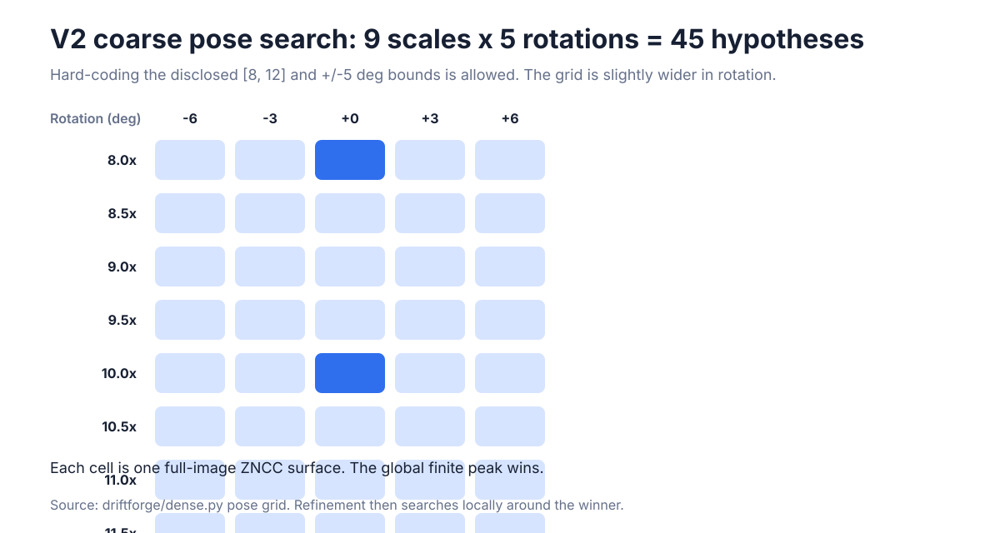

The method is the Phase 1 periodic-aware ZNCC pipeline **extended**, not
replaced: dense pose search over the disclosed ranges, band-passed matching,
local refinement, then two shipped models for presence and coordinate trust.
That is the extension the addendum lists as allowed.

Full architecture, sequence diagrams, and every chart:
**[docs/V1_VS_V2.md](docs/V1_VS_V2.md)**.

---

## How V2 works (short)

```text
pairs.csv
    → decode reference + search (grayscale or RGB)
    → 9 scales × 5 rotations = 45 dense ZNCC surfaces
    → keep the best finite peak
    → refine translation, scale, rotation (three passes)
    → presence model → found
    → correctness model → score
    → clamp pose / zero absent pose
    → one row in predictions.csv
```


Low-frequency charging is suppressed with a Difference-of-Gaussians band-pass
before ZNCC. On the internal stress corpus that moved localization from 18.6%
to **29.6%** within 1 px (McNemar p = 0.0002), with the gain concentrated at
severity 3.

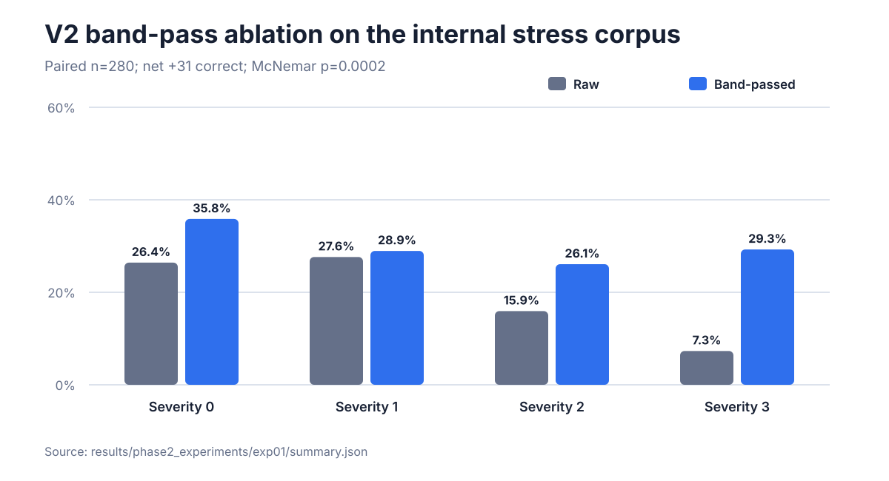

V1 still matters for the periodic core: residual ranking, candidate harvest,
and the centre tie-rule. Those pieces remain; V2 searches the dimensions
Phase 1 was given for free.


---

## Generator

```bash
python generate_dataset.py --phase 2 --split p2_val --count 20 \
    --output-dir generated/phase2 --modality gray --seed-base 20260827
```

Phase 1 pairs (fixed 10×, always present):

```bash
python generate_dataset.py --architecture DRAM --count 30 --output-dir generated/dram
python generate_dataset.py --architecture FinFET --count 30 --output-dir generated/finfet
```


The generator is deterministic, cited, and harder than the scored task
(independent acquisitions, same-architecture decoys, a four-level severity
ladder, RGB optical mode). Parameter-to-source table:
[docs/REFERENCES.md](docs/REFERENCES.md).

---

## Phase 1 benchmarks (known pose, always present)

These protocols do not apply to Phase 2 scoring. They document the V1 locator
that V2 extends.

| Benchmark | Protocol | Within 5 px | Median error |
|---|---|---:|---:|
| External development | 4 seeds × 30 pairs | **93.33% (112/120)** | 1.44 px |
| External untouched confirmation | held-back seed × 30 pairs | **100.00% (30/30)** | 1.46 px |
| Internal fixed stress | 80 scene-disjoint pairs | 48.75% (39/80) | 62.57 px |
| Internal randomized compliance | seed 2026 × 40 pairs | 55.00% (22/40) | 4.36 px |

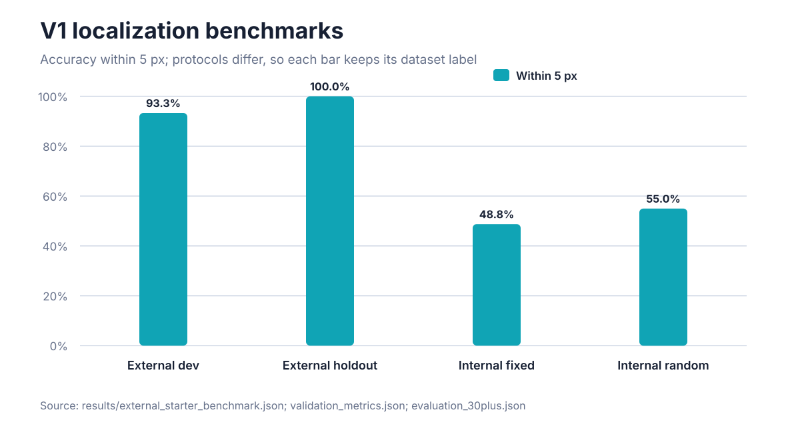

Evidence: [external summary](results/external_starter_benchmark.json) ·
[internal metrics](results/validation_metrics.json) ·
[claim provenance](results/claim_provenance.json).


---

## Reproduce and package

```bash
python -m pytest -q
python scripts/verify_evidence.py
python scripts/build_v2_visuals.py
python scripts/build_submission.py
python scripts/audit_phase2_contract.py dist/LatticeRank_Phase2.zip
```

`build_submission.py` packages from an explicit allow-list, refuses a
missing weight or a `failure_analysis.pdf` over two pages, then extracts the
zip to a scratch directory and runs `register.py` inside it.

License: [MIT](LICENSE).
