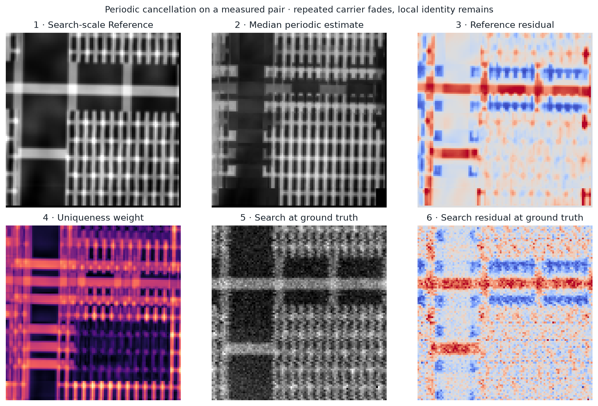
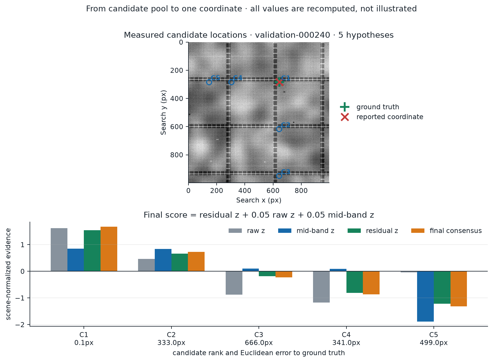
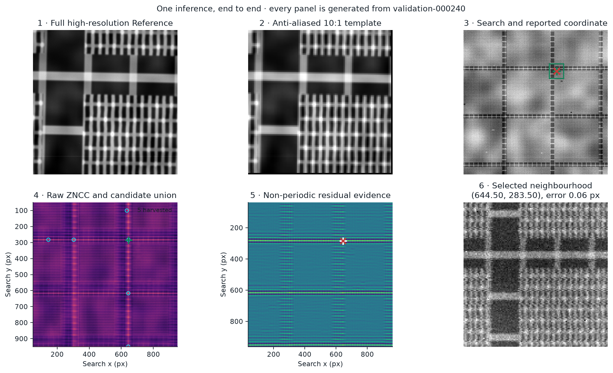

# LatticeRank

### Periodic-aware localization for semiconductor wafer inspection

LatticeRank locates a 1,000 × 1,000 high-magnification **Reference** field
inside a 1,000 × 1,000 **Search** image that covers ten times the physical
area. It returns exactly one Search coordinate: `(x, y)`.

The hard part is not finding a similar patch. DRAM and FinFET structures repeat,
so hundreds of locations can look correct. LatticeRank generates those
hypotheses, removes the repeating lattice, and ranks the non-periodic evidence
that remains.


## Run

Requires Python 3.11+ (the Phase 2 reference machine runs 3.11). The model is
included.

```bash
git clone https://github.com/RHUDHRESH/LatticeRank-SEMICON-2026.git
cd LatticeRank-SEMICON-2026
python -m venv .venv
```

Activate with `source .venv/bin/activate` on POSIX or
`.\.venv\Scripts\Activate.ps1` in PowerShell, then run:

```bash
python -m pip install --disable-pip-version-check -r requirements.txt
python scripts/judge_check.py
python scripts/verify_evidence.py
```

Inference:

```bash
python scripts/inference.py examples/dram/reference.png examples/dram/search.png
```

```text
(644.50, 283.50)
```

Add `--json` for diagnostics.

## Results

| Benchmark | Protocol | Within 5 px | Over 25 px | Median error |
|---|---|---:|---:|---:|
| External development | 4 seeds × 30 pairs | **93.33% (112/120)** | 6.67% | 1.44 px |
| External untouched confirmation | held-back seed × 30 pairs | **100.00% (30/30)** | 0.00% | 1.46 px |
| Internal fixed stress | 80 scene-disjoint pairs | 48.75% (39/80) | 51.25% | 62.57 px |
| Internal randomized compliance | seed 2026 × 40 pairs | 55.00% (22/40) | 45.00% | 4.36 px |


Evidence: [external summary](results/external_starter_benchmark.json) ·
[150 external predictions](results/external_starter_predictions.csv) ·
[internal metrics](results/validation_metrics.json) ·
[80 internal predictions](results/validation_predictions.csv) ·
[claim provenance](results/claim_provenance.json)

The correct site is a raw local maximum in **100%** of fixed scenes and enters
the candidate pool in **90.0%**, but final selection reaches **48.75%**.


## How it works

```text
Reference + Search
        │
        ▼
10:1 anti-aliased scale normalization
        │
        ▼
raw + mid-band + directionality correlation maps
        │
        ▼
adaptive local-maximum candidate pool
        │
        ▼
periodic cancellation + structural ranking
        │
        ▼
evidence-equivalent tie rule
        │
        ▼
      (x, y)
```

### 1. Normalize the physical scale

Anti-alias and reduce the complete Reference by the known 10:1 pixel ratio.

### 2. Preserve multiple plausible sites

Evaluate zero-mean normalized cross-correlation for each channel:

```text
ρc(x,y) = <Sxy − μxy, Tc − μT> / (||Sxy − μxy|| ||Tc − μT||)
```

Preserve an adaptive union of local maxima:

```text
C = ⋃c localmax(ρc ≥ max(ρc) − 0.10)
```

### 3. Cancel what repeats

Estimate the lattice and subtract the median of eight neighboring lattice
translations, leaving site-specific structure.

```text
periodic(I) = median of neighboring lattice translations
residual(I) = I − periodic(I)
```



### 4. Rank independent evidence

Inside the validated device-pitch envelope:

```text
score = z(periodic residual) + 0.05 z(raw ZNCC) + 0.05 z(mid-band ZNCC)
```

Broader geometry uses the packaged 77-feature HGB ranker plus residual evidence.



### 5. Handle exact wallpaper

Low-context wallpaper uses the challenge’s centre convention. The seven fixed
exact-wallpaper cases improve from 0/7 to **7/7** within 5 px.



## Examples

DRAM success: **0.06 px** error.


FinFET alias failure: **256.75 px** error.


## Synthetic data

DriftForge generates labeled DRAM and FinFET pairs with independent
Reference/Search acquisition effects.


```bash
python scripts/generate_dataset.py --architecture DRAM --count 30 --output-dir generated/dram
python scripts/generate_dataset.py --architecture FinFET --count 30 --output-dir generated/finfet
python scripts/validate_dataset.py generated/dram
```

[Parameter ranges and citations](docs/REFERENCES.md)

### Phase 2: unknown zoom, unknown rotation, absent pairs

DriftForge v2 extends the generator for the Phase 2 task: the reference is
drawn at an **unknown zoom** `s ∈ [8, 12]` — produced by the reference field
of view, never by resizing a 10x render — and an **unknown stage rotation**
of up to ±5° on top of the acquisition jitter. 20% of pairs in every split
contain **no true instance** (the reference comes from a different structural
realization of the same architecture and preset family), 40% of present
pairs carry same-architecture near-duplicate **decoys**, and a four-level
**severity ladder** widens dose, noise, PSF, charging, scan-geometry,
photometry, roughness, CD-bias and damage ranges well past the organizers'
disclosed degradation families. An **RGB optical mode** adds per-channel
reflectance, gain, colour cast and 0.3–1.2 px chromatic misregistration,
with ≥15% effectively-grayscale pairs. Because both images are independent
acquisitions of the latent world (separate RNG streams and acquisition
specs), the pairs are strictly harder than generators that crop the
reference from the same fine canvas as the search — which is why internal
accuracies here should not be compared against numbers produced on
single-canvas data.

Ground truth is **measured, not derived**: position from the target mask
tracked through the identical search warp; rotation and zoom from
brute-force ZNCC readouts at that known location, with the rotation-label
sign convention verified empirically by
`scripts/verify_conventions.py` (the naive `search − reference` formula has
the wrong sign under our template conventions). Twelve validation gates
(`scripts/validate_phase2.py`) cover oracle recovery of the pose, the
sponsor-baseline difficulty band, histogram-leak classifiers, crop-paste and
metadata-leak probes, marginal KS tests, and byte-identical regeneration.

```bash
python scripts/generate_dataset.py --phase 2 --split p2_val --count 400 \
    --output-dir data/phase2/p2_val --modality gray --seed-base 1300000
python scripts/validate_phase2.py --data-root data/phase2 \
    --splits p2_val --quick
python scripts/phase2_report.py --split-dir data/phase2/p2_val \
    --predictions preds.csv --output-dir results/phase2_report
```

## Reproduce

```bash
# Full release gates
python -m pytest -q
python scripts/verify_evidence.py

# Fixed and randomized evaluations
python scripts/evaluate.py validation --output-dir reproduced-validation
python scripts/evaluate.py randomized --count 40 --seed 2026 --output-dir reproduced-randomized

# Candidate-recall diagnostic and figures
python scripts/evaluate_candidate_recall.py --output reproduced-candidate-recall.json
python scripts/make_figures.py

# Phase 2 submission package, self-verifying
python scripts/build_submission.py
```

`build_submission.py` packages from an explicit allow-list rather than from git
state — `register.py`, the Phase 2 solver and both Phase 2 weight files are
untracked, so a `git archive` would quietly ship a Phase 1 submission. The build
fails if any required file is missing, if `failure_analysis.pdf` exceeds two
pages, or if that document cites an evidence file the zip does not contain; then
it extracts the finished archive to a scratch directory and runs the documented
entry point inside it, so a weight loaded by an accidental repo-relative path is
caught here rather than during the scored run.

Runtime: **2.86 s median**, **6.15 s mean**, **30.32 s P95**.
[Evidence](results/runtime.json)

## Phase 2 entry point

```bash
python register.py --input pairs.csv --output predictions.csv
```

One row per `pair_id`, columns `pair_id, x, y, theta, scale, found, score`.

| column | convention |
|---|---|
| `x`, `y` | match centre in wide-search pixels, origin top-left, subpixel |
| `theta` | degrees, **CCW positive**, about the match centre |
| `scale` | the **down-scaling factor** `s`, nominally in [8, 12] — not `1/s` |
| `found` | `1` or `0`; when `0`, all four pose columns are `0` |
| `score` | see below |

Three behaviours are structural rather than conventional. Every input pair
produces exactly one row, because a missing row scores zero — decode failures,
solver exceptions and watchdog expiry all still emit a row. When `found = 0`
the pose columns are zeroed but `score` still carries real evidence, because
the score column is judged separately for monotonicity against per-pair
correctness. And **an internal error is never written as a confident
rejection**: a caught exception emits the sentinel score `-1.0` and is reported
on stderr, so a crash is distinguishable from "I looked and it is not there".
Conflating the two would corrupt the rejection F1 and the confidence AUC at
once, and make a scored run impossible to debug afterwards.

### What `score` means

`score` is a **calibrated probability that the reported coordinate is correct**,
produced by a logistic model over 20 scene-level diagnostics — the peak
correlation and its margins, the refinement gain and displacement, the local
curvature of the correlation peak, and cheap image statistics standing in for
blur, charging and noise. It runs on 0 to 1, higher meaning more trustworthy.

It is deliberately **not** the raw correlation value. Measured on a held-out
lockbox of 74 pairs, the model separates correct from incorrect localizations at
**AUC 0.892** against **0.760** for the raw correlation peak on the same pairs.
By severity the figures are 0.950 / 0.975 / 0.857 / 0.830 at levels 0–3.

`found` answers a **different** question — does the reference exist in this
search image at all — and uses its own model, reaching F1 0.90–0.92 on its
lockbox with an operating threshold of 0.48. That threshold sits on a plateau:
every value in [0.40, 0.52] produces identical decisions, so the choice is not a
fragile bet on the blind set's severity mix.

The two columns can legitimately disagree, and that is the point. A pair may be
**present** (`found = 1`) yet **mislocalized** (`score` low): the reference is in
the image, but the coordinate reported for it is probably wrong. Collapsing both
into one number would hide exactly the case a process engineer needs to see.

Read operationally: above ~0.5 the coordinate is worth acting on; between ~0.1
and ~0.5 it warrants a confirming measurement; below that the tool is saying it
found something but does not trust where. A pair that could not be processed at
all scores `1e-6` — on scale, so the ranking stays monotone, rather than an
out-of-range sentinel.

Both models ship inside the repository as small pickles with provenance and
checksums in `driftforge/models/*.metadata.json`, and neither was trained on
organizer-supplied data.

## Phase 1 to Phase 2: what changed

Phase 2 removes three Phase 1 assumptions and adds nothing else. The method is
the Phase 1 periodic-aware approach extended to search the now-unknown pose,
which the addendum lists explicitly under what is allowed.

| stage | Phase 1 | Phase 2 | changed? |
|---|---|---|---|
| Scale normalization | fixed 10x, given | swept over the disclosed [8, 12] | **extended** |
| Rotation | treated as noise | swept over ±6°, reported | **extended** |
| Similarity | multi-channel ZNCC | same ZNCC, band-passed input | **extended** |
| Template construction | anti-aliased decimation | identical, scale-dependent sigma | unchanged |
| Periodic reasoning | lattice cancellation, residual ranking | unchanged | unchanged |
| Pose recovery | not required | brute-force oracles at the chosen site | **added** |
| Presence decision | always answered | threshold on the same score | **added** |

The band-pass is the one substantive change to the matching signal, and it is
measured: on 280 present pairs across `p2_val` and `p2_stress` it moved
localization from 18.6% to **29.6%** within 1 px (mean tiered credit 0.189 ->
0.334), paired McNemar `p = 0.0002`, for 0.05 s per pair. The gain concentrates
in the degraded regime — severity 3 rises from 7.3% to 29.3% — which is the
signature of suppressing the low-frequency charging drift that dominates Set B.

## Limitations

Measured on Phase 2 validation data, which is deliberately harder than the
disclosed blind-set specification: it plants same-architecture decoys on 40% of
present pairs and runs a severity ladder past the disclosed families. The
matched-pose ZNCC ceiling on this data is measured at ~0.40, so these numbers
should not be read as predictions for Set A.

- **Site selection is the dominant failure.** Localization error is effectively
  binary: when the correct site is chosen the answer is already subpixel, and
  when it is not the error is a lattice-scale jump. Half of the misses are
  near-integer lattice translations of the truth.
- **Candidate recall is a ceiling**, measured at ~74.3%; a quarter of pairs
  never have the true site in the pool at all.
- **Severity 3 is the hard regime** (29.3% after the band-pass, against 35.8%
  at severity 0).
- Pose recovery is conditional on localization and is not itself a limitation:
  scale lands within 1% and rotation within 0.25° on essentially every pair
  that localizes.
- Earlier Phase 1 claims that FinFET is distinctly weaker than DRAM **do not
  reproduce** under Phase 2 conditions (25.0% vs 34.6% after the band-pass,
  with overlapping intervals on smaller samples).
- All scored evidence is synthetic; no sponsor SEM test pairs were available.
- DRAM and FinFET still share one orthogonal-line rendering primitive; a more
  device-specific generator needs a generator-family holdout and retraining.

License: [MIT](LICENSE).
