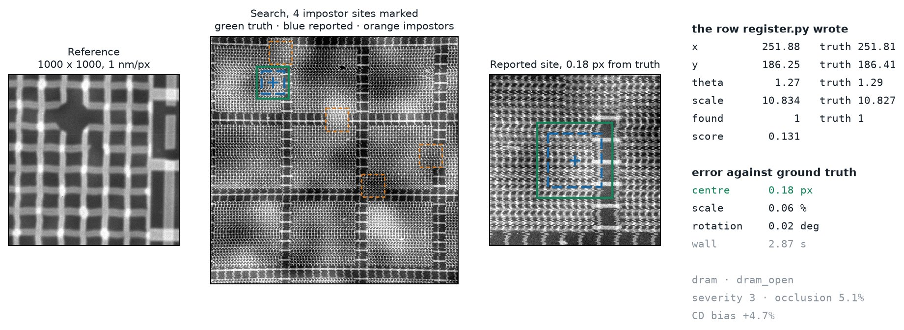
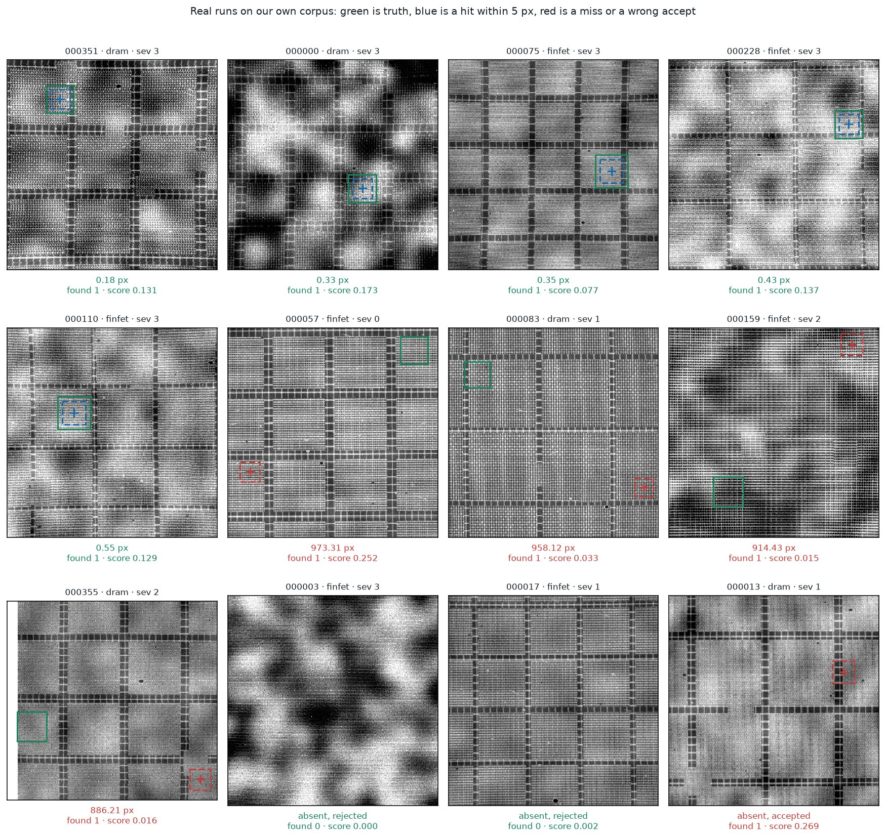
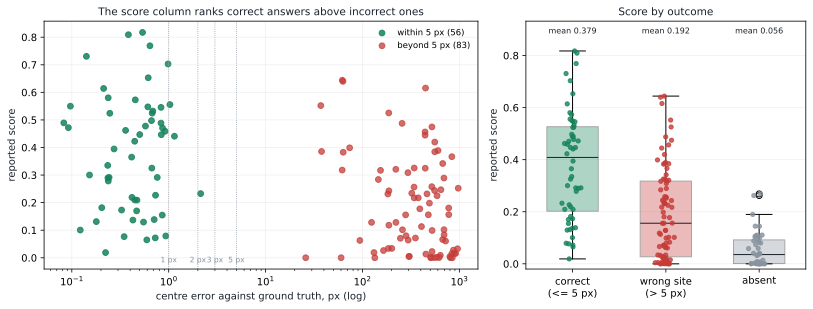
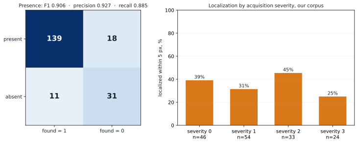

# LatticeRank

Periodic-aware registration for semiconductor wafer inspection.

A 1000×1000 high-magnification **reference** must be found inside a 1000×1000
**search** image of a repeating DRAM or FinFET field. The hard part is not
similarity. Hundreds of lattice copies look correct. LatticeRank ranks
site-specific residual evidence so the reported coordinate is the true copy,
not a periodic alias.

**This zip is Phase 2.** Zoom, rotation, and presence are unknown. The program
writes one CSV row per pair:

```text
pair_id, x, y, theta, scale, found, score
```

Official sample, organizer data, frozen solver, published rubric:
**79.14 / 85** scored points, plus the RGB and rejection-F1 bonuses.

```bash
python register.py --input pairs.csv --output predictions.csv
```

## What one registration looks like

Not a diagram. One pair from our own corpus, run through the same
`register.process` the scored entry point calls, with the packaged weights and
the shipped per-pair budget:



Green is ground truth, blue is what the solver reported, orange dashed squares
are the near-duplicate impostor sites the generator planted to catch it. The
right-hand column is the CSV row against the truth it is scored on: at severity
3, with 5.1% occlusion and +4.7% CD bias, the reported centre is **0.18 px** from
truth and the scale is within **0.06%**.

Reproduce it, and the section 3 figures, with:

```bash
python scripts/build_inference_gallery.py
```

| Read next | Why |
|---|---|
| [docs/HOW_TO_RUN.md](docs/HOW_TO_RUN.md) | Copy-paste run sheet and output contract |
| [docs/JOURNEY.md](docs/JOURNEY.md) | How this was built: what worked, what failed, what we retracted |
| [docs/V1_VS_V2.md](docs/V1_VS_V2.md) | V1 → V2 architecture, diagrams, every chart |
| [docs/failure_analysis.md](docs/failure_analysis.md) | Leftover points and measured limits |
| [docs/REFERENCES.md](docs/REFERENCES.md) | Generator citations |


*Figure 1. The addendum changes zoom, rotation, presence, and the output row. Image size, top-left origin, nearest-to-centre rule, and Python-zip rules do not change.*

---

## 1. Scored run

Python **3.11**, 4-core CPU, 8 GB RAM, **no GPU, no network**. Weights are
already in `driftforge/models/`.

```bash
python -m pip install --disable-pip-version-check -r requirements.txt
python register.py --input pairs.csv --output predictions.csv
```

That signature is exact. Not a notebook. Not an interactive prompt.

Organizer input:

```csv
pair_id,search_path,reference_path
p001,search/p001.png,reference/p001.png
```

Image paths may be relative to the CSV, relative to `register.py`, or
absolute. RGB Set D frames decode to one grayscale plane. The evaluator's
working directory does not have to be the package root.

Confirm the entry point on the two shipped examples:

```bash
python register.py --input examples/pairs.csv --output predictions.csv
```


*Figure 2. `register.py` always emits a row. If time runs short, refinement or presence features can be skipped. The CSV is still valid.*

### Output contract

```csv
pair_id,x,y,theta,scale,found,score
```

| Column | Meaning |
|---|---|
| `x`, `y` | Match centre in search pixels. Origin top-left. Subpixel allowed. |
| `theta` | Degrees, counter-clockwise positive, about the match centre. |
| `scale` | Down-scaling factor in `[8, 12]`. Not `1/s`. |
| `found` | `1` or `0`. When `0`, the four pose columns are `0`. |
| `score` | Probability the reported coordinate is the correct site, in `[0, 1]`. |

Every input `pair_id` appears **exactly once**. A missing row scores zero, so
decode failures, exceptions, and deadline expiry still write a row. An
internal crash is never reported as a confident rejection (`score = 1e-6`).


*Figure 3. Phase 1 returned a point. Phase 2 returns a pose, a presence flag, and a separate trust value.*

`found` and `score` are different models. A present pair can still be the
wrong lattice copy: `found = 1` with a low `score` is then the correct report.


*Figure 4. Use `found` for presence. Use `score` to decide whether to trust the coordinate. Do not threshold `score` into a second presence flag.*

---

## 2. Official sample

The only evaluation on **organizer-generated data**: 20 pairs (8 nominal, 6
degraded, 4 absent, 2 RGB). Run once after the solver was frozen. Nothing was
tuned on it.

| Block | Result | Points |
|---|---|---:|
| Localization | Set A 0.975 · Set B 0.967 · Set D 1.000 | **38.82 / 40** |
| Pose, gated on localization | mean credit 0.8656 | **17.31 / 20** |
| Rejection | F1 0.9412 (TP 16, FP 2, FN 0) | **14.12 / 15** |
| Confidence | AUC 0.8889 of `score` vs correctness | **8.89 / 10** |
| RGB bonus | Set D 1.000, A–C 0.9704 | **+6** |
| Rejection-F1 bonus | F1 ≥ 0.90 | **+4** |

**79.14 / 85** before bonuses.
Source: [official_sample_evaluation.json](results/phase2_experiments/official_sample_evaluation.json).


*Figure 5. Localization, pose, rejection, and confidence on the 20-pair organizer sample. Efficiency and the generator write-up are jury-judged.*


*Figure 6. The organizers' brute-force ZNCC baseline scores 0.800 mean present credit and 0 on the three hardest Set B pairs. LatticeRank scores 1.00 on those three.*


*Figure 7. Two false positives (p016, p018). Zero false negatives. The `score` column still ranks both false positives below every present pair. That observation was not used to retune the threshold.*

Runtime on this sample: **median 4.61 s, max 4.79 s**, 0 pairs over the 5 s
median budget, far under the 20 s hard timeout. Uncontended internal timing
(n=60, 4 threads): median 2.92 s.

The 200-pair blind set is 70 nominal + 70 degraded + 40 absent + 20 RGB.
Credit is tiered (1 / 2 / 3 / 5 px; 1% / 2% / 5% scale; 0.25° / 0.5° / 1.0°
rotation). See [V1_VS_V2.md](docs/V1_VS_V2.md) for the full chart set.

**Numbers below this line are not the scored task.** Our generator renders
reference and search as independent acquisitions. The organizer sample cuts
the reference from the search canvas. That gap is measured, not assumed:
[failure_analysis.md](docs/failure_analysis.md), and it is worth +35 points of
localization on a paired test — see [JOURNEY.md](docs/JOURNEY.md) section 5.

---

## 3. Live run on harder data

Twenty pairs is a thin sample. This is the same solver over **199 stratified
pairs of our own corpus**, where reference and search are independent
acquisitions. It is the harder problem, so the rate is far below the official
sample's, and that is the point: it is where the failure mode is visible.

| Measured on 199 pairs, 157 present | Value |
|---|---|
| Localized within 5 px | **56 / 157 = 35.7%** |
| Within 1 px / 3 px / 5 px / 10 px | 53 / 56 / 56 / **56** |
| Median centre error | 145.81 px |
| Presence F1 (`found`) | **0.906** — TP 139, FP 11, FN 18, TN 31 |
| `score` AUC against correctness | **0.756** |
| Runtime, median / max per pair | 2.92 s / 3.41 s |

The tier row is the load-bearing one. Of 139 present pairs that got a pose, the
count within 1 px and the count within 10 px are the **same 56 pairs**:
localization error here is binary. Pick the right lattice site and the answer is
already subpixel; pick a wrong one and it is a whole period away. That is why
mean localization credit equals site-selection accuracy, why subpixel
refinement cannot move the 40-point block, and why the effort went into
`score` telling you which of the two happened.



*Figure 8. Not a highlight reel: wins, the characteristic miss, and the rejections. Green is truth, blue a hit within 5 px, red a miss or a wrong accept. Every miss is a whole lattice copy away — never a blurry near-answer.*



*Figure 9. The operationally important plot. When the solver picks the wrong site, the `score` column largely knows: mean 0.379 on correct answers against 0.192 on wrong sites and 0.056 on absent pairs, AUC 0.756. The distributions overlap, so this is a ranking signal for triage, not a clean threshold — which is why `score` is reported separately instead of being folded into `found`.*



*Figure 10. `found` is a separate model from `score`, so it gets a separate measurement: F1 0.906 here. Localization does **not** fall off cleanly with acquisition severity (39 / 31 / 45 / 25% at severities 0–3), which matches the finding that the severity ladder is not what governs the rate — see [JOURNEY.md](docs/JOURNEY.md) section 5.*

Per-pair records, including the misses:
[inference_gallery.json](results/phase2_experiments/inference_gallery.json).

---

## 4. V1 versus V2

| | V1 | V2 |
|---|---|---|
| Question | Where is this known-scale reference? | Is it present, where, what pose, and how trustworthy? |
| Output | `x, y` | `x, y, theta, scale, found, score` |
| Scale | Fixed 10× | Nine scales in `[8, 12]` |
| Rotation | Treated as noise | Five angles, then local refinement |
| Presence | Always present | Independent `found` model |
| Entry | `scripts/inference.py` | `register.py` |

V2 is the Phase 1 periodic-aware matcher **extended** over the disclosed pose
ranges, plus presence and confidence. That is the extension the addendum lists
as allowed.


*Figure 11. Nine scales × five rotations. Each cell is a full-image ZNCC surface. The global finite peak is refined locally.*

Full architecture, sequence diagrams, and the remaining charts:
**[docs/V1_VS_V2.md](docs/V1_VS_V2.md)**.

---

## 5. Method, short

```text
decode  →  45 dense ZNCC poses  →  refine  →  found  →  score  →  one CSV row
```


*Figure 12. Find the high-magnification reference inside the wide search field. Periodicity makes the naive argmax the wrong answer.*

A Difference-of-Gaussians band-pass (`σ = 2` minus `σ = 8`) suppresses
low-frequency charging before correlation. On the internal stress corpus that
moved localization from 18.6% to **29.6%** within 1 px (McNemar *p* = 0.0002),
with the gain at severity 3 — exactly where Set B is weighted.


*Figure 13. Same pose sweep and selection rule; only the ZNCC input changes. The gain is charging-drift suppression, not generic contrast.*


*Figure 14. Subtract the repeating lattice, keep site-specific structure. This is the V1 core that V2 still uses after pose search.*

---

## 6. Zip contents

| Addendum requirement | In this zip |
|---|---|
| `python register.py --input pairs.csv --output predictions.csv` | `register.py` |
| `requirements.txt` from `pip freeze` | `requirements.txt` |
| Documented generator | `generate_dataset.py` and `scripts/generate_dataset.py` |
| `failure_analysis.pdf`, max 2 pages | `docs/failure_analysis.pdf` (1 page) |
| Weights inside the zip | `driftforge/models/*.pkl`, `*.joblib` |

```bash
python generate_dataset.py --phase 2 --split p2_val --count 20 \
    --output-dir generated/phase2 --modality gray --seed-base 20260827
```


*Figure 15. Synthetic pairs with independent acquisition effects. Harder than cropping a reference from the search canvas.*

Cited ranges: [docs/REFERENCES.md](docs/REFERENCES.md).

---

## 7. Phase 1 benchmarks

Known pose, always present. These protocols do not apply to Phase 2 scoring.
They document the locator that V2 extends.

| Protocol | Within 5 px | Median error |
|---|---:|---:|
| External development, 120 pairs | **93.33%** | 1.44 px |
| External holdout, 30 pairs | **100.00%** | 1.46 px |
| Internal fixed stress, 80 pairs | 48.75% | 62.57 px |
| Internal randomized, 40 pairs | 55.00% | 4.36 px |


*Figure 16. External pairs are easier. Internal fixed stress is dominated by lattice-scale aliases, which is why V2 keeps residual ranking.*


*Figure 17. When the correct site is chosen, the answer is already subpixel.*


*Figure 18. When it is not, the error is a whole cell, not a blurry couple of pixels.*

---

## 8. Verify and package

```bash
python -m pytest -q
python scripts/verify_evidence.py
python scripts/build_v2_visuals.py            # the diagram set
python scripts/build_inference_gallery.py     # the live-run figures, section 3
python scripts/build_submission.py
python scripts/audit_phase2_contract.py dist/LatticeRank_Phase2.zip
```

The packager uses an explicit allow-list, refuses a missing weight or a
failure-analysis PDF over two pages, then extracts the zip elsewhere and runs
`register.py` inside it.

A [26-second terminal demo](docs/demo/latticerank_demo.mp4) of the run ships with
the zip. A 3:56 explainer video renders from the tracked slides and narration
script with `python scripts/render_explainer_video.py`; the MP4 itself is not in
git. Neither is needed to score the entry.

License: [MIT](LICENSE).
