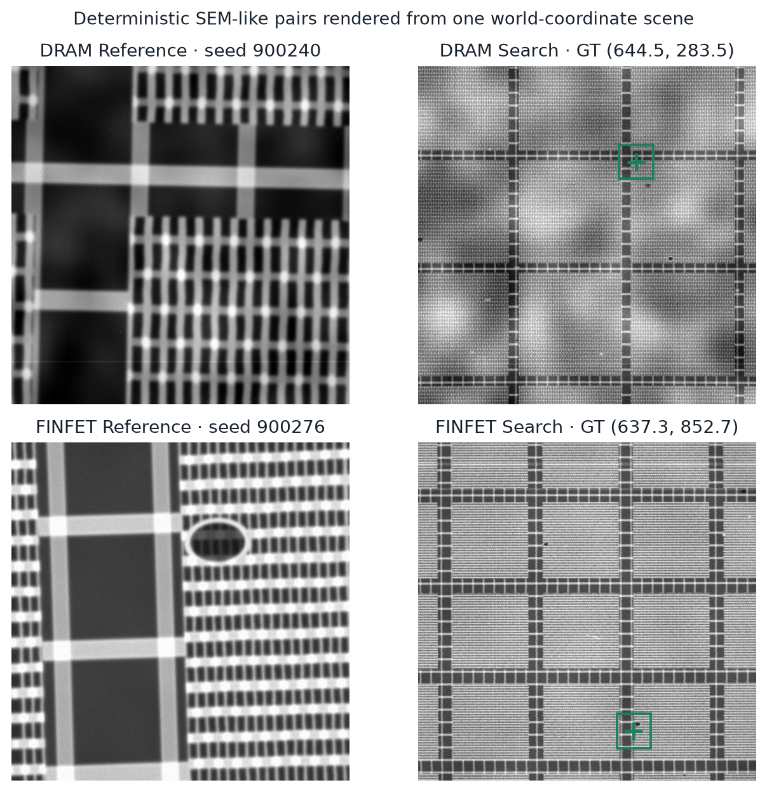

# Data generator

DriftForge is a deterministic **SEM-like procedural proxy** for testing
cross-scale localization. It is not a Monte Carlo electron-transport simulator,
not a manufacturing-node model, and not evidence that its parameter ranges match a
particular fabrication line.



## Shared physical scene

Each pair starts from one analytical world-coordinate scene measuring
10,000 nm × 10,000 nm. The Reference samples a 1,000 nm field at 1 nm/px;
Search samples the whole world at 10 nm/px. Both outputs are 1,000 × 1,000
pixels.

The renderer uses two broad geometry families:

- **DRAM-like:** orthogonal word/bit-line families, alternating contacts,
  repeated array mats, and routing/periphery strips.
- **FinFET-like:** parallel fins crossed by gates, alternating contacts,
  repeated mats, and routing/periphery strips.

Pitch, width, phase, line jitter, width variation, roughness, boundaries, and
world-coordinate defects vary by seed. These are domain-randomization priors,
not a reconstruction of undisclosed sponsor imagery.

## Independent acquisitions

Reference and Search are rendered from the same latent scene but captured with
independent RNG streams. Each stream independently samples:

- edge brightening and anisotropic Gaussian PSF;
- affine rotation, scale, and translation;
- radial distortion, row-wise scan shear, and row jitter;
- gain, offset, gamma, and vignette;
- smooth charging fields and occasional streaks;
- Poisson counting noise, Gaussian read noise, and hot pixels.

This avoids sharing the same noise realization or acquisition transform across
the two images. The simulated mechanisms follow public SEM imaging literature,
but their numerical distributions remain phenomenological; the exact
source-to-choice mapping is in [References](REFERENCES.md).

## Ground truth

The Reference footprint is represented as a soft mask in Search
world coordinates. The mask passes through the same Search affine, scan, and
radial warps as the Search image. The final label is the warped mask centroid,
so it includes Search-side geometric distortion:

```text
x = column, y = row, origin = top-left, units = Search pixels
```

Structural defects are sampled in world coordinates from a scene-only random
stream. Their positions do not read the target centre, Reference crop, or
label. This corrects the historical target-correlated landmark defect; the
superseded contaminated result is not used in the release evidence.

## Profiles

- `standard`: nominal geometry and acquisition variation.
- `hard`: stronger noise, roughness, defects, scan shear, and jitter.
- `boundary`: forces the Reference to cross an array/periphery seam.
- `ambiguous`: an intentionally exact periodic wallpaper; the target is moved
  to the phase-equivalent site nearest the Search centre.
- `ood`: wider geometry and acquisition perturbations for stress testing.

## Determinism and provenance

A manifest record fixes sample ID, scene ID, architecture, profile, and seed.
The generator records those values plus scene and acquisition parameters.
Reference and Search RNG streams are deterministic functions of the seed.
Manifests keep train, validation, test, and stress scene IDs disjoint.

Generate a small balanced dataset:

```bash
python scripts/generate_dataset.py --count 4 --architecture both \
  --seed-start 910000 --output-dir data/smoke
```

PowerShell:

```powershell
python scripts/generate_dataset.py --count 4 --architecture both `
  --seed-start 910000 --output-dir data/smoke
```

The output contains `reference/`, `search/`, per-sample metadata,
`labels.csv`, `ground_truth.json`, and `DATASET_INFO.json`. Use
`--hide-labels` only with an empty output directory.

## Committed examples

- [DRAM Reference](../examples/dram/reference.png),
  [Search](../examples/dram/search.png), and
  [ground truth](../examples/dram/ground_truth.json)
- [FinFET Reference](../examples/finfet/reference.png),
  [Search](../examples/finfet/search.png), and
  [ground truth](../examples/finfet/ground_truth.json)

These pairs are regenerated by `python scripts/make_figures.py`; the PNGs carry
no avoidable text or timestamp metadata.
