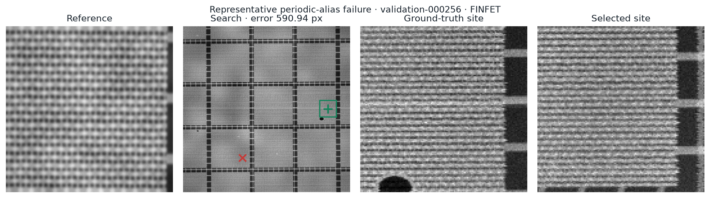

# Failure analysis

The final system fails catastrophically on **47 of 80 validation pairs
(58.75%)**, where catastrophic means a coordinate error greater than 25 Search
pixels. The error distribution is strongly bimodal: successful predictions are
usually within a few pixels, while failures are often hundreds of pixels away.

## Dominant mechanism: periodic alias selection

Dense DRAM- and FinFET-like layouts repeat at many Search locations. Global
correlation can therefore produce several strong, spatially distant peaks.
Candidate harvesting usually preserves the true site—the shipped δ=0.10 pool
has 90.0% recall within 5 pixels—but the ranker selects it only 41.25% of the
time.

In this real validation case, the selected FinFET site is 590.94 pixels from
ground truth. Both local crops contain the same dominant fins and routing
boundary, but their non-repeating details differ.

## Are the aliases truly indistinguishable?

A separate latent-scene audit examined 30 catastrophic cases without
acquisition noise:

- median NCC between the true and selected latent patches: 0.859;
- only 6.7% have latent NCC ≥0.95;
- 76.7% have latent NCC ≤0.90.

Most aliases are therefore distinguishable in the generated physical scene.
The open problem is extracting and ranking the weak non-periodic evidence
reliably after scale change, noise, blur, and scan distortion. This does not
prove that every case is distinguishable, and the deliberately `ambiguous`
profile contains exact wallpaper cases.

## Architecture gap

Final ≤5 px accuracy is 48.7% for DRAM and 34.1% for FinFET. The candidate
stage already shows the same direction: at shipped δ=0.10, recall is 94.9% for
DRAM and 85.4% for FinFET. FinFET's denser line family occupies fewer Search
pixels per period, leaving less distinctive context after 10× reduction.

The δ=0.15 values—97.4% DRAM and 87.8% FinFET—only describe the wider
candidate pool. They do not change the final 41.25% localization result.

## What helped, and what did not solve it

- Multi-channel harvesting raises candidate coverage but increases the ranking
  burden as δ grows.
- Spatial structural features improve top-1 from 37.5% to 40.0% on identical
  validation pairs.
- Periodic-residual evidence raises final top-1 to 41.25% and lowers the
  catastrophic rate from 60.0% to 58.75%.
- The nearest-centre rule is restricted to a narrow measured equivalence set;
  using Search-centre distance as a learned feature would leak the tie policy
  into ordinary, non-equivalent decisions.

## Scope

These findings are synthetic-only. No real sponsor SEM pairs were available,
so the measured rates establish internal generator performance, not expected
fab performance. See
[failure_analysis.json](../results/failure_analysis.json) for the compact
provenance record and [Results](RESULTS.md) for the benchmark protocol.
