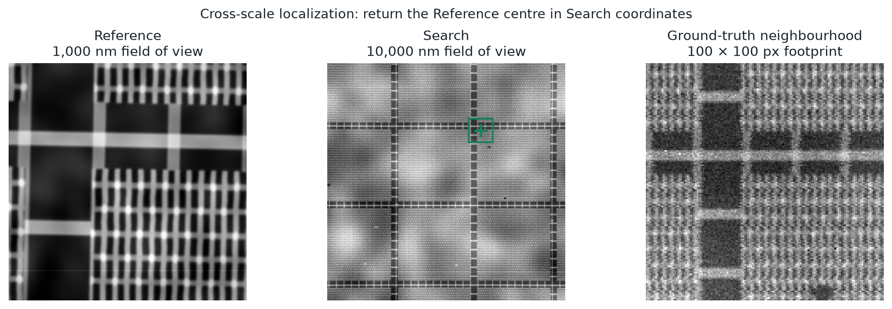
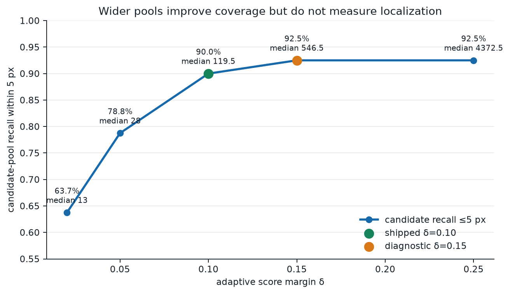
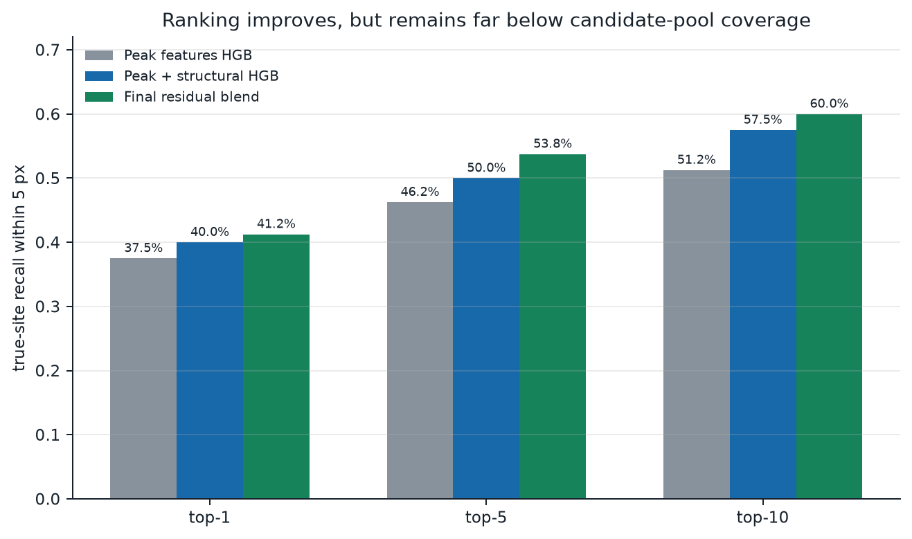
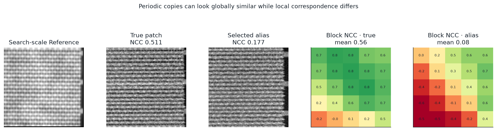

# Method

LatticeRank localizes the centre of a 1,000 × 1,000 high-magnification
Reference image inside a 1,000 × 1,000 Search image covering ten times the
physical field of view. Coordinates are reported as `(x, y)`, where `x` is
column, `y` is row, the origin is the top-left Search pixel, and units are
Search pixels.



## Final pipeline

1. **Build a Search-scale template.** The complete Reference is low-pass
   filtered and reduced by the known 10:1 pixel-size ratio. It is never pasted
   into Search.
2. **Compute three response maps.** Zero-mean normalized cross-correlation
   (ZNCC) is evaluated on robust-contrast intensity, a Gaussian mid-band
   channel, and a polarity-invariant doubled-angle gradient field.
3. **Harvest candidates.** Each channel contributes local maxima whose score is
   within `δ` of that channel's maximum. The three sets are unioned. Production
   inference uses **δ=0.10** and caps the feature computation at 8,000
   candidates.
4. **Describe each candidate.** The 77 model inputs combine 26 scene-relative
   peak/lattice/noise measurements with 51 spatial correspondence
   measurements. The latter compare the Search patch with the template using
   tiny-shift ZNCC, blockwise correlation, profiles, gradients, directionality,
   and local spectra.
5. **Rank candidates.** A balanced scikit-learn
   `HistGradientBoostingClassifier`, trained on scene-disjoint synthetic
   scenes, assigns candidate probabilities. Distance to the Search centre is
   prohibited as a learned feature.
6. **Add periodic-residual evidence.** Eight lattice-shifted copies estimate
   the repeating background. Their median is subtracted, and a weighted ZNCC
   score on the non-repeating residual is z-normalized and added to the
   ranker score with weight 1.0.
7. **Apply the tie rule.** Candidates within 0.05 z-score of the best final
   score form an evidential equivalence set. Only then is the candidate nearest
   the Search centre selected.

The candidate features used for training and inference share the
`compute_candidate_rows` implementation. Model loading also validates the
ordered feature schema and estimator dimensionality.

## Candidate coverage is not localization



The wider **δ=0.15 diagnostic** contains a candidate within 5 pixels of ground
truth for 92.5% of pairs (97.4% DRAM, 87.8% FinFET). It is not the shipped
setting and it is not localization accuracy.

The shipped **δ=0.10 pipeline** has 90.0% candidate-pool recall, then selects a
final location with 41.25% accuracy within 5 pixels. This gap is the ranking
problem:



## Why spatial correspondence

Global correlation often assigns similar scores to many lattice translations.
The descriptor preserves where correspondence succeeds or fails within the
100 × 100 Search-scale footprint:



The visual is an actual measured failure
(`validation-000256`), not a schematic. Its selected alias is 590.94
pixels from ground truth.

## Reproduce

Generate the evidence figures and compact examples:

```bash
python scripts/make_figures.py
```

Run inference:

```bash
python scripts/inference.py examples/dram/reference.png examples/dram/search.png
```

Normal stdout is exactly a parenthesized coordinate. `--json` adds model and
candidate diagnostics. The available final-pipeline measurement is
approximately 5 seconds per pair, with one worker and without network access.
That is the precision of the retained source artifact; see
[`runtime.json`](../results/runtime.json) for provenance and limitations.

See [Results](RESULTS.md), [Generator](DATA_GENERATOR.md), and
[References](REFERENCES.md).
