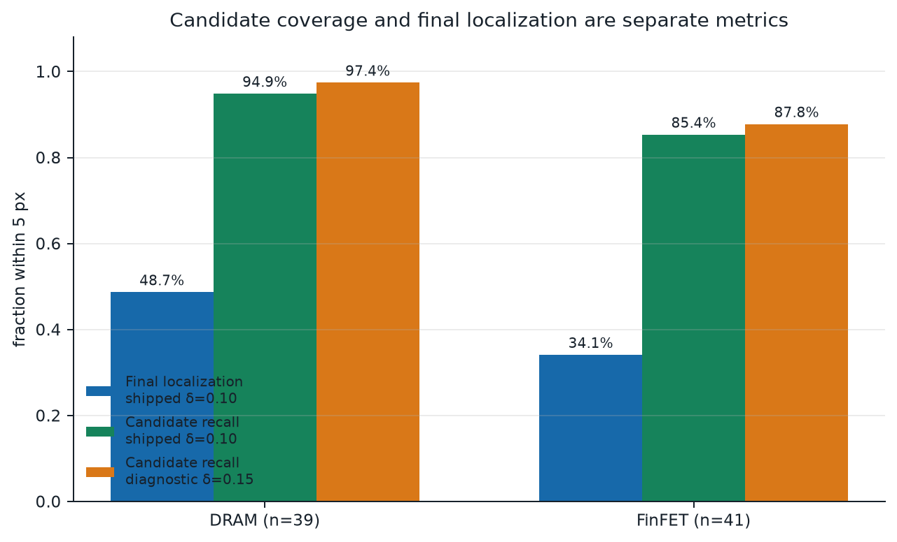
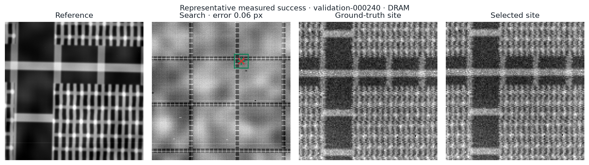

# Results

## Headline measurement

The final shipped pipeline achieves **41.25% localization accuracy within
5 Search pixels** on 80 leak-free, scene-disjoint validation pairs:
39 DRAM and 41 FinFET. It uses the shipped **δ=0.10** candidate setting.

- ≤1 px: 33.75%
- ≤2 px: 40.00%
- ≤5 px: **41.25%**
- top-5 contains a ≤5 px candidate: 53.75%
- top-10 contains a ≤5 px candidate: 60.00%
- median error: 178.62 px
- P95 / P99 error: 687.97 / 904.87 px
- catastrophic error >25 px: **58.75%**
- DRAM / FinFET ≤5 px: 48.72% / 34.15%

The source is [validation_metrics.json](../results/validation_metrics.json);
all 80 row-level records are in
[validation_predictions.csv](../results/validation_predictions.csv).
`top1_error_px` is the field underlying the 41.25% headline; the coordinate
and `error_px` columns preserve the separately measured equivalence-set
selection for auditability.

The high median is not a contradiction: 41.25% of pairs are within 5 pixels,
while most remaining pairs jump to distant lattice aliases.

## Candidate recall: separate diagnostic

Candidate-pool recall asks whether **any** harvested candidate is within
5 pixels of ground truth. It does not ask whether the ranker selects that
candidate.

- **Shipped δ=0.10:** 90.0% overall, 94.9% DRAM, 85.4% FinFET; median
  119.5 candidates.
- **Diagnostic δ=0.15:** **92.5% overall, 97.4% DRAM, 87.8% FinFET**; median
  546.5 candidates.

The δ=0.15 numbers are a wider-pool diagnostic only. They must not be reported
as final localization accuracy or as the shipped inference protocol. See
[candidate_recall.json](../results/candidate_recall.json).

## Measured ablation

All rows below use the same 80 validation pairs.

| Ranking system | ≤5 px | top-5 | top-10 | >25 px |
|---|---:|---:|---:|---:|
| HGB, peak-strength features | 37.50% | 46.25% | 51.25% | 62.50% |
| HGB, peak + structural features | 40.00% | 50.00% | 57.50% | 60.00% |
| Final, plus periodic-residual blend | **41.25%** | **53.75%** | **60.00%** | **58.75%** |

The residual score adds 1.25 percentage points over the combined ranker and
reduces the catastrophic rate by 1.25 points. These are small measured gains,
not a solved ambiguity problem.

## Representative measured cases

Success — `validation-000240`, DRAM hard profile, error 0.06 px:

Failure — `validation-000256`, FinFET standard profile, periodic-alias
error 590.94 px:

Both figures regenerate the real seeded pair and overlay coordinates from the
committed prediction table.

## Evidence status

- Main validation: measured and curated.
- Candidate-recall sweep: measured and curated.
- 30+ pair randomized compliance evaluation:
  **not run during cleanup**. No substitute subset metric is published.
- Final end-to-end runtime: **8.2 s** on the committed DRAM example through
  `scripts/inference.py`. This is a one-pair smoke, not an 80-pair mean.
  See [runtime.json](../results/runtime.json).

The claim-to-artifact map is
[claim_provenance.json](../results/claim_provenance.json). The final
clean-environment benchmark was intentionally not rerun during this fast
cleanup pass.
