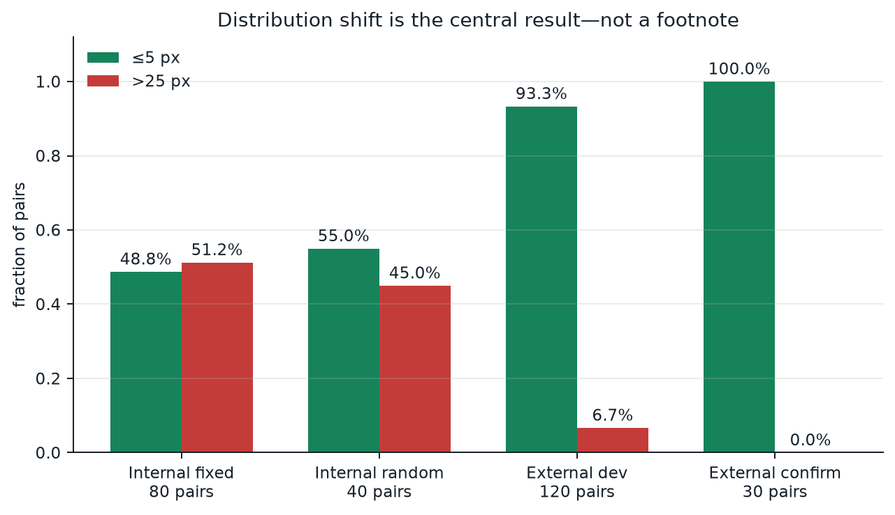
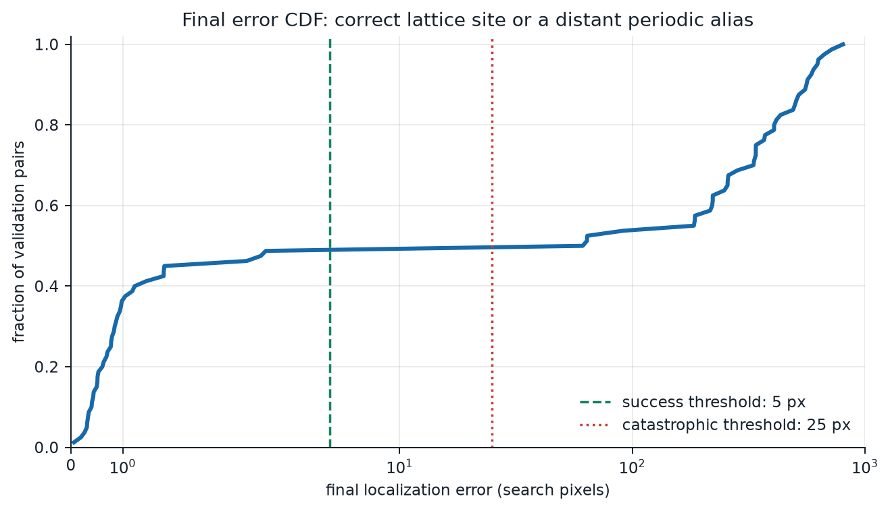

# Results

## The answer in one figure



LatticeRank exceeds 90% on a pinned public reference-style generator and does
not exceed 90% on DriftForge's broader internal stress distribution. The
repository reports the split explicitly instead of pooling unlike generators.

| Benchmark | Role | Pairs | ≤5 px | >25 px | Median | Maximum |
|---|---|---:|---:|---:|---:|---:|
| External seeds 4200–4600 | development | 120 | **93.33%** | 6.67% | 1.44 px | 557.97 px |
| External seed 4700 | untouched confirmation | 30 | **100.00%** | 0.00% | 1.46 px | 2.04 px |
| Internal fixed | scene-disjoint stress | 80 | 48.75% | 51.25% | 62.57 px | 804.80 px |
| Internal seed 2026 | randomized compliance | 40 | 55.00% | 45.00% | 4.36 px | 835.38 px |

Every numerator is recomputed from `pred_x`, `pred_y`, `gt_x`, and `gt_y` by:

```bash
python scripts/verify_evidence.py
```

The command fails if a stored error or headline rate disagrees with the final
coordinates.

## External confirmation: where the residual consensus works

The external generator is
[`FlankerDev12/drift-sense-ref`](https://github.com/FlankerDev12/drift-sense-ref)
pinned at commit `59376381eb284cdeb48cc727b1b75ca29c842437`. It is described as a
public reference-style generator, not as the official hidden evaluator.

The production score is fixed as:

```text
score = z(periodic residual) + 0.05 z(raw ZNCC) + 0.05 z(mid-band ZNCC)
```

Candidates within 0.025 of the maximum form the evidence-equivalent set; the
challenge centre rule breaks only that tie. Seeds 4200, 4300, 4400, and 4600
were used while freezing this equation. Seed 4700 was then evaluated without
further tuning and localized all 30 pairs within 5 pixels.


Evidence:

- [summary, source hashes, and exact equation](../results/external_starter_benchmark.json)
- [150 final coordinate rows](../results/external_starter_predictions.csv)
- [external evaluation harness](../scripts/evaluate_external_starter.py)
- [trace aggregator](../scripts/aggregate_external_benchmark.py)

The development maximum error remains 557.97 px. A 93.33% rate is strong, but
the remaining errors are still remote aliases, not harmless near misses.

## Internal fixed stress: the unresolved failure mode

The final packaged pipeline localizes **39 of 80 pairs (48.75%)** within 5
Search pixels. Its 95% Wilson interval is **38.1%–59.5%**.

- ≤1 px: 36.25%
- ≤2 px: 45.00%
- ≤5 px: 48.75%
- catastrophic error >25 px: 51.25%
- DRAM / FinFET ≤5 px: 51.28% / 46.34%
- median / P95 / maximum: 62.57 / 624.78 / 804.80 px
- runtime median / mean / P95 / maximum: 2.86 / 6.15 / 30.32 / 45.20 s

The candidate pool contains a correct point for **72 of 80 pairs (90.0%)**.
That is a proposal-stage ceiling, not localization accuracy. Selection is the
binding problem.



Evidence: [metrics](../results/validation_metrics.json),
[80 coordinate rows](../results/validation_predictions.csv), and
[candidate recall](../results/candidate_recall.json).

## Randomized 30+ compliance run

The independent seed-2026 run contains 40 newly sampled pairs and is kept
separate from the fixed split:

- final ≤5 px: **22/40 = 55.0%**;
- 95% Wilson interval: **39.8%–69.3%**;
- candidate recall ≤5 px: **34/40 = 85.0%**;
- catastrophic error >25 px: **18/40 = 45.0%**;
- median / maximum error: 4.36 / 835.38 px.

Evidence: [metrics](../results/evaluation_30plus.json) and
[40 final coordinate rows](../results/evaluation_30plus_predictions.csv).

## Exact wallpaper

All seven exact-wallpaper pairs in the fixed benchmark localize within 5
pixels. When candidate multiplicity is high and both coarse context and
long-context decay collapse, the image does not contain defensible evidence
for one periodic copy. LatticeRank returns Search centre as required by the
challenge convention and skips the expensive ranker.

This is a subgroup result, not evidence that ordinary remote-alias selection is
solved.

## Aggressive experiments and rejection gates

The 90% goal was tested rather than inferred from tuning data. These approaches
were rejected:

- a nonlinear eleven-signal fusion scored 37/40 on its tuning half and only
  11/40 on the untouched half;
- a random-forest fusion likewise fell from 37/40 to 14/40;
- a tiny Siamese encoder reached 5% alone and 33.75% in ensemble;
- line-fingerprint and local keypoint-consensus prototypes each reached 15%
  on the same locked 20-pair diagnostic slice;
- oracle affine alignment improved residual selection but remained far below
  the required ceiling;
- 256- and 1,024-candidate shortlists discarded valid true sites.

Only the exact-wallpaper rule and the externally validated residual consensus
were promoted. See the [experiment ledger](../results/optimization_experiments.json)
and [failure analysis](FAILURE_ANALYSIS.md).

## Reproduce

```bash
python scripts/evaluate.py validation --output-dir reproduced-validation
python scripts/evaluate.py randomized --count 40 --seed 2026 --output-dir reproduced-randomized
python scripts/make_figures.py
python scripts/verify_evidence.py
```

External confirmation, after cloning the pinned public source:

```bash
python scripts/evaluate_external_starter.py /path/to/drift-sense-ref \
  --count 30 --seed 4700 --output reproduced-external-4700.json
```
