# LatticeRank V1 → V2

V1 answers **where is this known-scale reference?**
V2 answers **is it present, where is it, what is its pose, and how trustworthy
is that answer?**

The matching core did not change. Periodic residual evidence still decides
which lattice copy is the true one. V2 searches the dimensions Phase 1 was
given for free, then adds presence, confidence, a deadline, and a guaranteed
output row.

| Jump | Section |
|---|---|
| [1. Comparison](#1-one-screen-comparison) | What each version must output |
| [2. Architecture](#2-architecture-what-stayed-what-expanded-what-was-added) | Shared lineage vs new stages |
| [3. Data flow](#3-v2-end-to-end-data-flow) | One pair, CSV in to CSV out |
| [4. Stages](#4-how-v2-works-stage-by-stage) | Paths, pose grid, band-pass, refine, found vs score |
| [5. Results](#5-measured-results) | Official sample, V1 benchmarks, why internal numbers differ |
| [6. How to read a row](#6-operational-reading-of-v2-output) | Process-engineer view |
| [7. Safeguards](#7-failure-modes-and-safeguards) | What V2 hardened |
| [8. Run](#8-run-and-verify-v2) | Commands |
| [9. Charts](#9-rebuild-every-chart-in-this-guide) | Regenerable SVGs |

Jury run sheet: [HOW_TO_RUN.md](HOW_TO_RUN.md).
Citations: [REFERENCES.md](REFERENCES.md).
Limits: [failure_analysis.md](failure_analysis.md).
How it was built: [JOURNEY.md](JOURNEY.md).

---

## 1. One-screen comparison

| Dimension | V1 | V2 |
|---|---|---|
| Primary job | Translation-only localization | Presence-aware 4-DoF registration |
| Required output | `(x, y)` | `(x, y, theta, scale, found, score)` |
| Reference scale | Fixed 10×, known | Unknown down-scaling factor in `[8, 12]` |
| Rotation | Acquisition noise | Searched and reported, nominally ±5° |
| Presence | Always present | May be absent (~20%) |
| Inputs | Grayscale | Grayscale and RGB-compatible decode |
| Similarity | Multi-channel ZNCC + periodic ranking | Band-passed ZNCC on a pose grid |
| Candidates | Adaptive local maxima, residual rank, tie rule | Dense sweep, best peak, local refine |
| Confidence | Diagnostic scores | P(coordinate is correct) |
| Failure | May stop or omit a row | Always one valid row |
| Runtime | Measured, uncapped | Deadline with staged degradation |
| Entry point | `scripts/inference.py` | `register.py` |


*The Phase 1 statement still applies. Only zoom, rotation, presence, and the output row are new. Hard-coding `[8, 12]` and ±5° is allowed.*

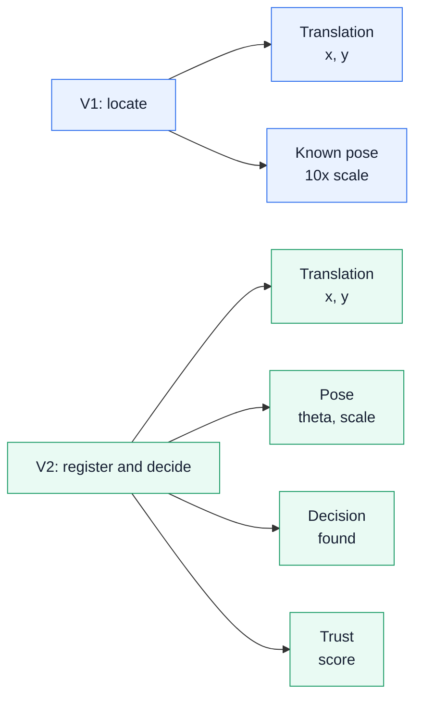


*Sets A and B feed localization and pose. Set C feeds rejection F1. Set D is RGB bonus only.*


*Filled bars are official-sample measurements. Efficiency and the generator write-up are jury-judged.*

---

## 2. Architecture: what stayed, what expanded, what was added

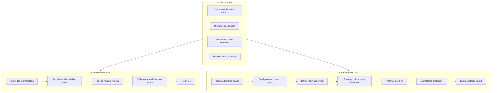

Extension, not replacement. The physical scale normalization and the
normalized-correlation family are the same. V2 searches the dimensions the
task no longer supplies.

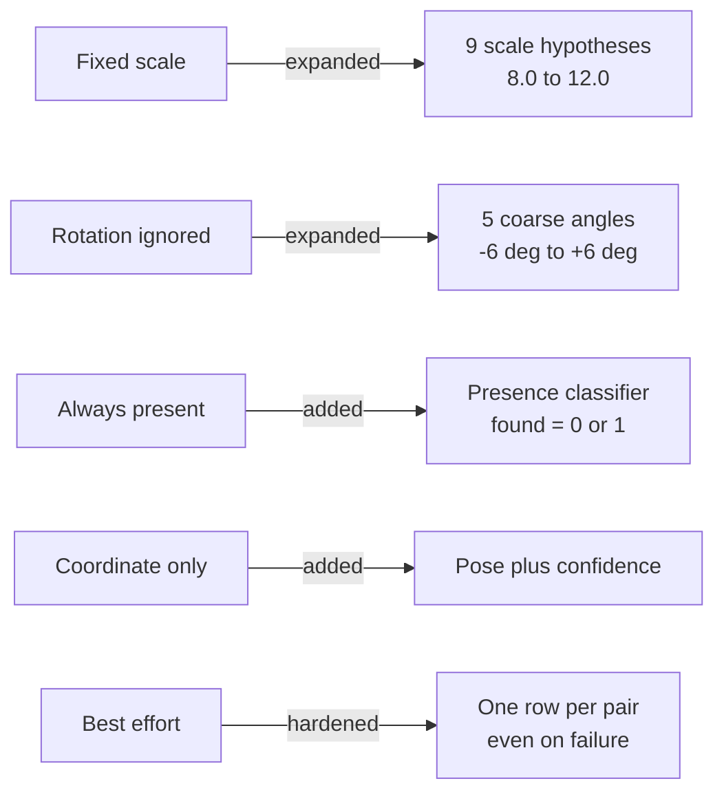

---

## 3. V2 end-to-end data flow

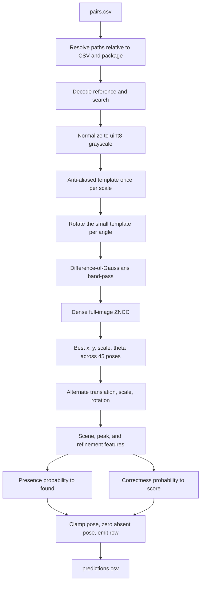


*Later stages may be skipped under a deadline. The row is still written.*

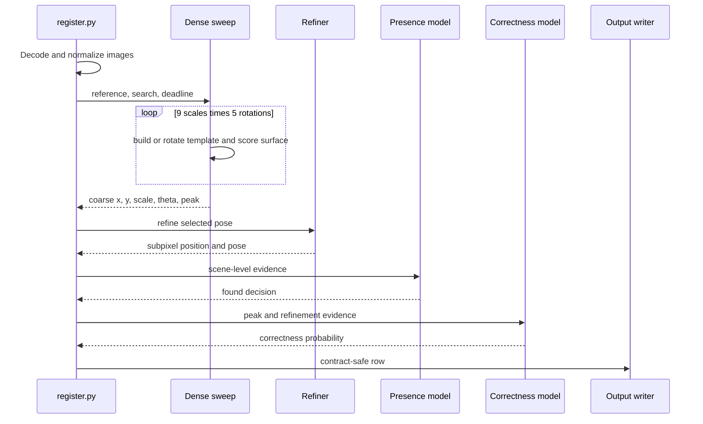

---

## 4. How V2 works, stage by stage

### 4.1 Input and path safety

`register.py` accepts several header spellings for the pair id, reference
path, and search path. Relative paths are tried against the CSV directory and
the submission directory, so the evaluator can start from an unrelated working
directory.

Supported single-frame modes (grayscale, palette, RGB, RGBA, CMYK, numeric)
convert deterministically to one `uint8` plane.

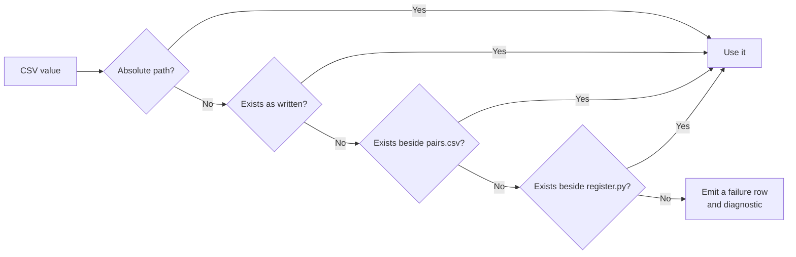

### 4.2 Pose search

V1 is told the scale. V2 must estimate it. Anti-aliasing is done once per
scale; only the small template rotates in the angle loop.

```text
scale grid    = 8.0, 8.5, ..., 12.0
rotation grid = -6, -3, 0, +3, +6 deg
pose count    = 9 x 5 = 45
```

Each pose scores a full valid ZNCC surface. The global finite peak wins. That
avoids a proposal cap dropping the true site.


*Hard-coding the disclosed bounds is allowed. Rotation search is slightly wider than ±5° so endpoints are not clipped during optimization. Reported pose is then clamped.*

### 4.3 Band-passed matching

Low-frequency charging can dominate raw intensity while carrying little
position. V2 correlates on:

```text
band_pass(I) = Gaussian(I, sigma=2) - Gaussian(I, sigma=8)
```


*Paired n = 280 internal pairs. Net +31 correct, McNemar p = 0.0002. Gain concentrates at severity 3, where Set B is weighted 0.55.*

Source: [`exp01/summary.json`](../results/phase2_experiments/exp01/summary.json).

### 4.4 Full-resolution refinement

The grid is coarse on purpose. After site selection, three alternating passes:

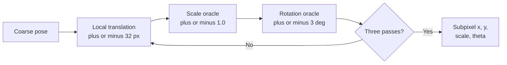

Translation uses local full-resolution correlation and a parabolic peak fit.
When several periodic peaks are nearly equivalent, the refiner keeps the one
nearest the incoming estimate rather than jumping a lattice period.

### 4.5 Presence and correctness are different questions

- `found` — does the reference occur in this search image at all?
- `score` — is the reported coordinate the correct site?

A present pair localized to the wrong copy is `found = 1` with a low `score`.
That is coherent. Do not threshold `score` into a second presence flag.


*Official-sample false positives sit in the low-score, found = 1 region. That split was recorded, not used to retune.*

### 4.6 Output contract

| Column | Meaning | Enforcement |
|---|---|---|
| `pair_id` | Input identity | One row per unique id |
| `x`, `y` | Search-image centre | Finite, clipped to bounds |
| `theta` | CCW degrees | Clipped to the disclosed reportable range |
| `scale` | Down-scaling factor | Clipped to `[8, 12]` |
| `found` | Presence | Exactly `0` or `1` |
| `score` | P(coordinate correct) | Finite, on `[0, 1]` |

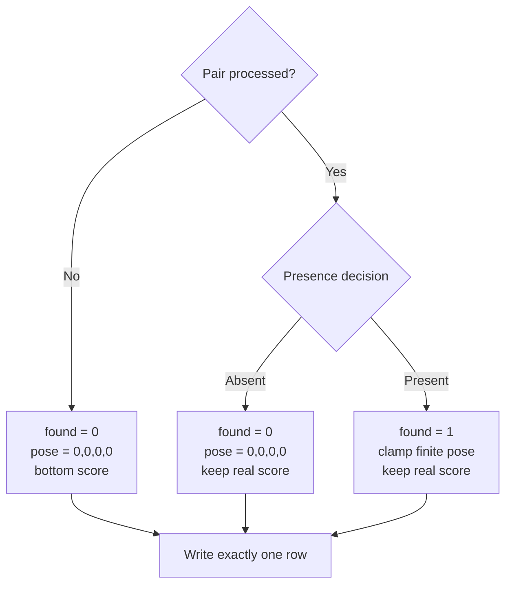


*A missing row scores zero. An internal error uses score = 1e-6 so it is not counted as a confident reject.*

### 4.7 Runtime and graceful degradation

The dense sweep is the expensive stage. Later stages consult a deadline.

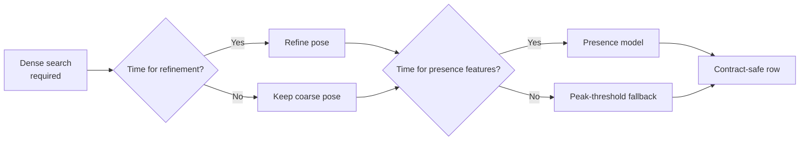


*n = 60 internal pairs, 4 threads. Median 2.92 s. Official-sample median is 4.61 s. Both sit under the 5 s budget.*


*Hard timeout scores that pair zero. No measured pair approaches 20 s.*

---

## 5. Measured results

### 5.1 V2 official sample

Twenty organizer pairs: 8 nominal, 6 degraded, 4 absent, 2 RGB. Run once after
the solver was frozen. Aggregate metrics only — no organizer imagery or
coordinates are stored here.


*Present pairs only. Set C is rejection, not localization.*

| Block | Measurement | Points |
|---|---:|---:|
| Localization | weighted credit 0.9704 | **38.82 / 40** |
| Pose | gated mean credit 0.8656 | **17.31 / 20** |
| Rejection | F1 0.9412 | **14.12 / 15** |
| Confidence | AUC 0.8889 | **8.89 / 10** |
| RGB | Set D 1.000, A–C 0.9704 | **+6 bonus** |

**79.14 / 85** before the RGB bonus.


*TP 16, FP 2, FN 0. The two false positives remain below every present score.*


*Naive baseline mean present credit 0.800. It scores 0 on p011, p012, p014. LatticeRank scores 1.00 there.*


*Pose is scored only where localization credit is already greater than 0. A pose on the wrong tile is zero.*

Source: [`official_sample_evaluation.json`](../results/phase2_experiments/official_sample_evaluation.json).

### 5.2 V1 benchmarks

Not a Phase 2 comparison. V1 uses known pose and always-present pairs.


| Protocol | Within 5 px | Median error |
|---|---:|---:|
| External development, 120 pairs | 93.33% | 1.44 px |
| External holdout, 30 pairs | 100.00% | 1.46 px |
| Internal fixed stress, 80 pairs | 48.75% | 62.57 px |
| Internal randomized, 40 pairs | 55.00% | 4.36 px |

Sources: [`external_starter_benchmark.json`](../results/external_starter_benchmark.json),
[`validation_metrics.json`](../results/validation_metrics.json),
[`evaluation_30plus.json`](../results/evaluation_30plus.json).

### 5.3 Do not mix official and internal V2 numbers

The internal generator renders reference and search as independent
acquisitions. The organizer sample cuts the reference from the search canvas.
One paired experiment isolates that choice.


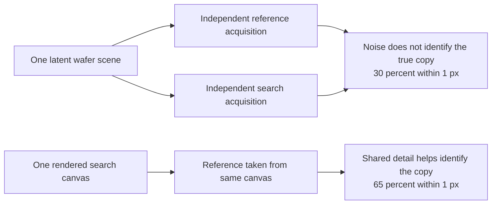

The ~30% internal stress result is not a forecast of the ~97% official
localization credit. The protocols answer different questions.

Source: [`samecanvas_bound.json`](../results/phase2_experiments/samecanvas_bound.json).

---

## 6. Operational reading of V2 output

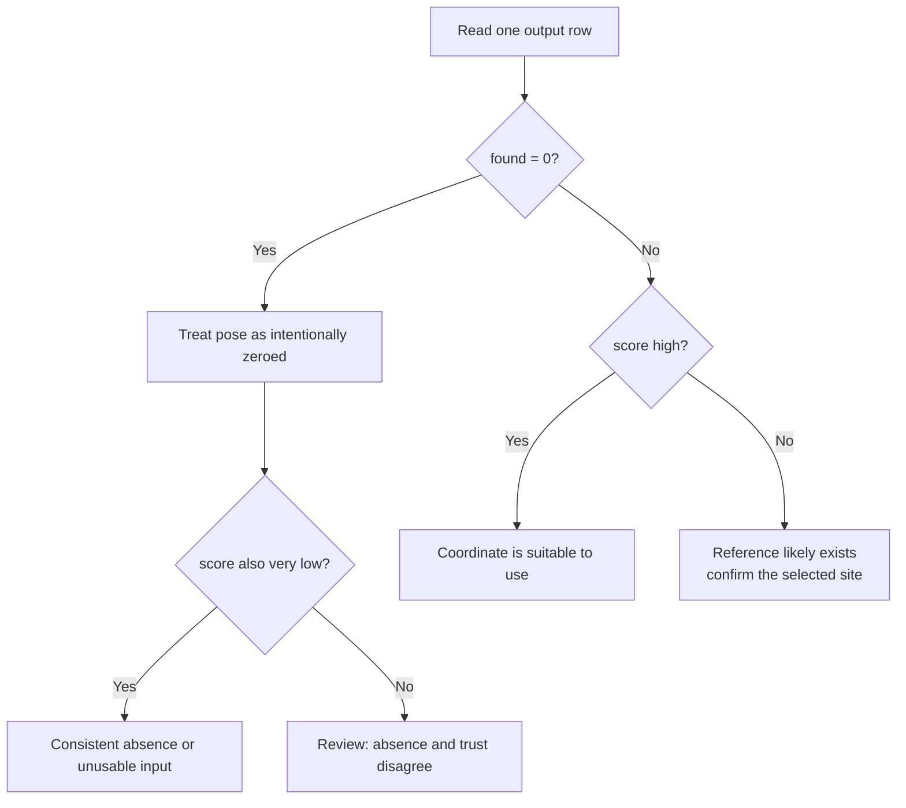


1. Use `found` for presence / re-scan.
2. Use `score` to prioritize review or automation.
3. Never recover pose from a `found = 0` row.

---

## 7. Failure modes and safeguards

| Failure | V1 exposure | V2 safeguard |
|---|---|---|
| Wrong working directory | Paths fail globally | Resolve relative to CSV and package |
| Corrupt or unsupported image | Run may stop | Valid failure row + stderr |
| Constant image / invalid ZNCC | Non-finite peak | Reject non-finite evidence |
| True site dropped by proposal cap | Candidate-recall ceiling | Dense full-image sweep |
| Periodic jump in refinement | Whole-period error | Prefer equivalent peak nearest seed |
| Unknown pose | Outside V1 contract | 45 hypotheses, then refine |
| Absent reference | Forced false localization | Independent presence model |
| Wrong copy, present pair | Hidden behind a coordinate | Separate correctness score |
| Slow machine | Tail exceeds budget | Deadline-aware stage shedding |
| Internal exception | Missing row | One contract-safe row per pair |

---

## 8. Run and verify V2

```bash
python -m pip install --disable-pip-version-check -r requirements.txt
python register.py --input pairs.csv --output predictions.csv
```

```csv
pair_id,x,y,theta,scale,found,score
```

Full sheet: [HOW_TO_RUN.md](HOW_TO_RUN.md).

```bash
python -m pytest -q
python scripts/verify_evidence.py
python scripts/build_submission.py
python scripts/audit_phase2_contract.py dist/LatticeRank_Phase2.zip
```

---

## 9. Rebuild every chart in this guide

The SVGs are generated from tracked evidence JSON. They are not hand-edited.

```bash
python scripts/build_v2_visuals.py
```

| Chart | File | Evidence |
|---|---|---|
| Scorecard | `v2_official_scorecard.svg` | official sample JSON |
| Per-set credit | `v2_official_sets.svg` | official sample JSON |
| Scoring mix | `v2_scoring_allocation.svg` | addendum + official sample |
| Blind 200 mix | `v2_dataset_composition.svg` | addendum |
| Credit tiers | `v2_credit_tiers.svg` | addendum |
| Rejection matrix | `v2_rejection_matrix.svg` | official sample JSON |
| vs naive ZNCC | `v2_vs_baseline.svg` | organizer baseline + official sample |
| Pose grid | `v2_pose_grid.svg` | `driftforge/dense.py` |
| found vs score | `v2_presence_vs_score.svg` | `register.py` contract |
| Output columns | `v2_output_contract.svg` | addendum |
| Pipeline | `v2_pipeline.svg` | `register.py` |
| How to read | `v2_how_to_read.svg` | contract |
| Phase change | `v2_phase_change.svg` | addendum |
| Runtime histogram | `v2_runtime.svg` | uncontended_runtime.json |
| Runtime vs budget | `v2_runtime_budget.svg` | official + uncontended JSON |
| Band-pass ablation | `v2_filter_ablation.svg` | exp01/summary.json |
| Acquisition gap | `v2_acquisition_gap.svg` | samecanvas_bound.json |
| V1 benchmarks | `v1_benchmarks.svg` | external + validation JSON |

---

## 10. Files

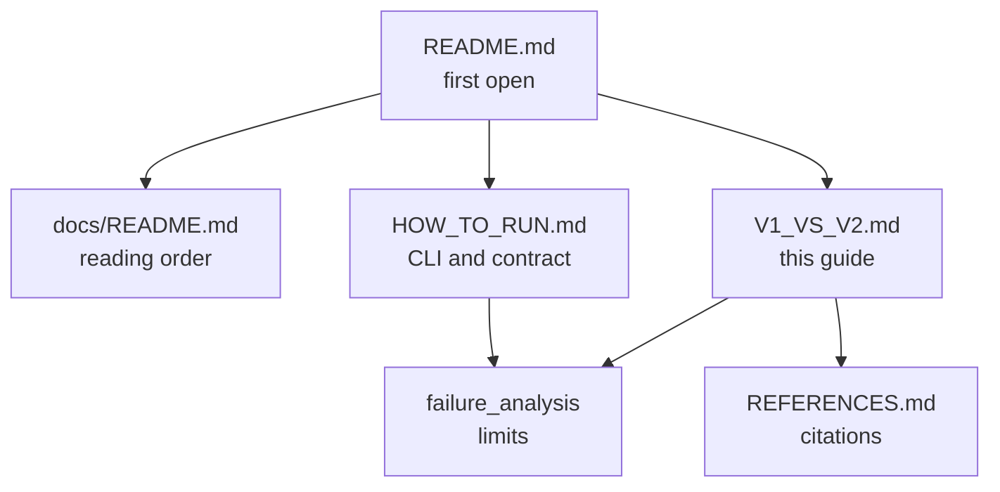

| Area | File |
|---|---|
| Scored entry | `register.py` |
| Generator, zip root | `generate_dataset.py` |
| Generator implementation | `scripts/generate_dataset.py` |
| Deadline | `driftforge/budget.py` |
| Dense pose sweep | `driftforge/dense.py` |
| Templates and conventions | `driftforge/pose.py` |
| Local refine | `driftforge/refine.py` |
| Presence | `driftforge/presence_model.py` |
| Correctness | `driftforge/correctness_model.py` |
| Synthetic data | `driftforge/generator.py`, `driftforge/phase2.py` |
| Contract audit | `scripts/audit_phase2_contract.py` |
| Zip packager | `scripts/build_submission.py` |
| Charts | `scripts/build_v2_visuals.py` |

---

## 11. Bottom line

```text
V1 = locate(x, y | fixed pose, present)

V2 = decide presence
   + search translation, scale, rotation
   + refine the selected pose
   + estimate coordinate correctness
   + guarantee a valid row under every failure mode
```

The official sample — **79.14 / 85** plus RGB bonus — shows the expanded
contract works end to end. Internal stress remains useful because it isolates
the acquisition condition under which periodic site identity is the limit.
