# LatticeRank V1 → V2

## Visual architecture guide, migration notes, and measured evidence

V2 keeps the central V1 idea—match semiconductor structure while respecting
periodicity—but expands a fixed-pose locator into a complete registration
system. It now searches scale and rotation, decides whether the reference is
present, reports calibrated confidence, accepts grayscale or RGB inputs, stays
inside a time budget, and guarantees one valid output row for every input row.

> **Short version:** V1 answers **“where is this known-scale reference?”** V2
> answers **“is it present, where is it, what is its pose, and how trustworthy
> is the answer?”**


## 1. One-screen comparison

| Dimension | V1 | V2 |
|---|---|---|
| Primary job | Translation-only localization | Presence-aware 4-DoF registration |
| Required output | `(x, y)` | `(x, y, theta, scale, found, score)` |
| Reference scale | Fixed 10×, known in advance | Unknown down-scaling factor in `[8, 12]` |
| Rotation | Treated as acquisition noise | Searched and reported, nominally ±5° |
| Reference presence | Always present | May be absent |
| Input channels | Grayscale workflow | Grayscale and RGB-compatible decoding |
| Core similarity | Multi-channel ZNCC with periodic reasoning | Band-passed ZNCC across a pose grid |
| Candidate handling | Adaptive local maxima, residual ranking, tie rule | Dense pose sweep, best surface peak, local refinement |
| Confidence | Diagnostic scores | Calibrated probability of coordinate correctness |
| Failure behavior | Coordinate result | Valid zero-pose row plus low score |
| Runtime control | Measured but uncapped | Per-pair deadline with staged degradation |
| Entry point | `scripts/inference.py` | `register.py` |

### The contract grew in three directions

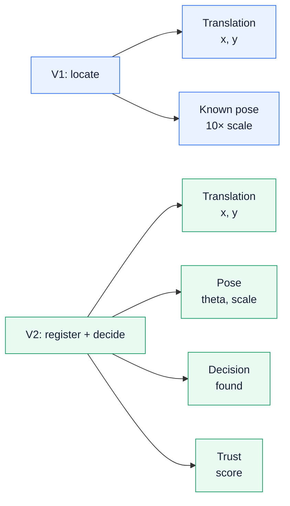

## 2. Architecture: what stayed, what expanded, what was added

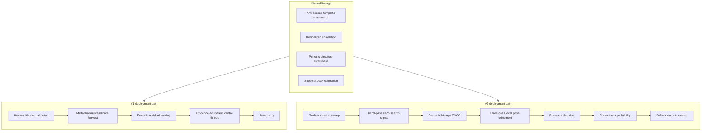

The important design choice is extension rather than replacement. The V2 code
reuses the same physical scale normalization and normalized-correlation family,
then searches the dimensions that are no longer supplied by the task.

### Change map

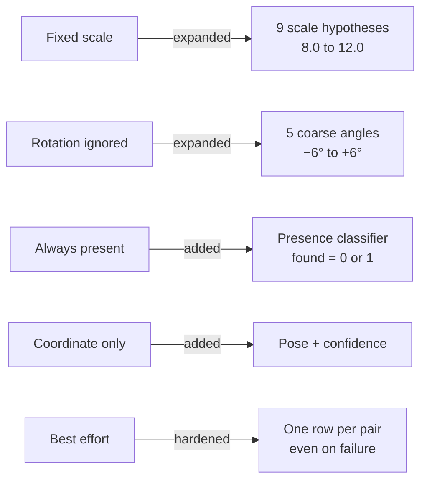

## 3. V2 end-to-end data flow

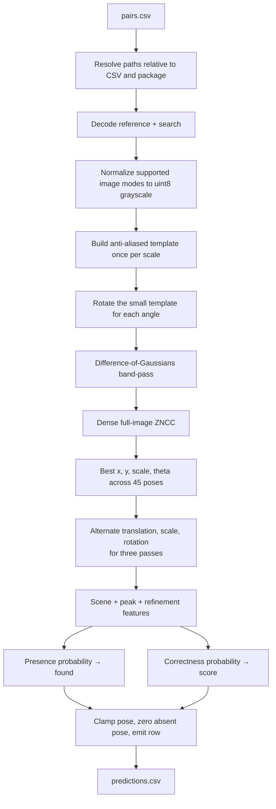

### Processing sequence for one pair

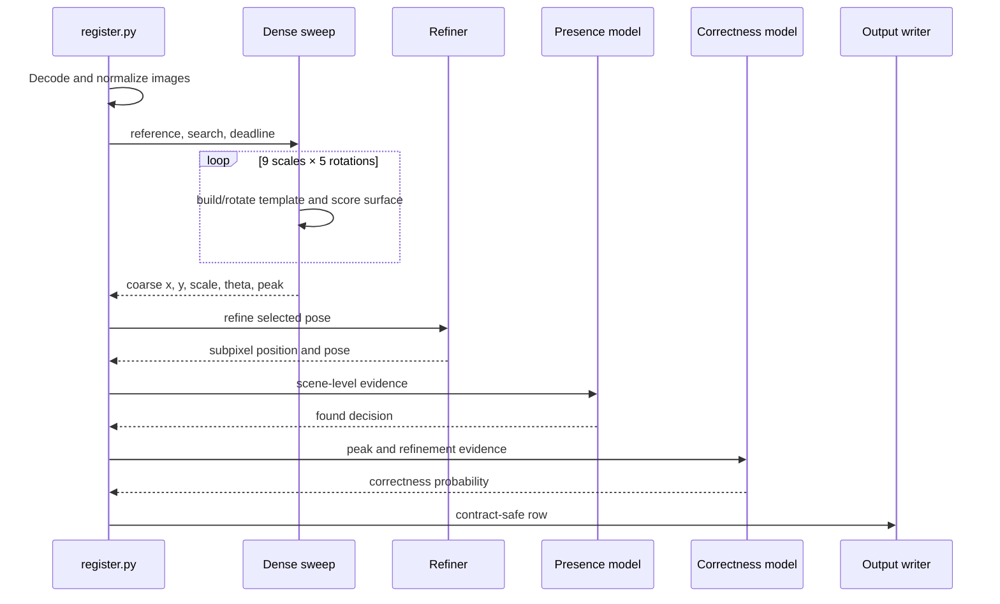

## 4. How V2 works, stage by stage

### 4.1 Input and path safety

`register.py` accepts several sensible header spellings for the pair identifier,
reference path, and search path. Relative image paths are tried against the CSV
directory and the submission directory, so the evaluator can launch the program
from an unrelated working directory.

Supported single-frame inputs include common grayscale, palette, RGB, RGBA,
CMYK, and numeric image modes. They are converted deterministically to a single
`uint8` plane before matching.

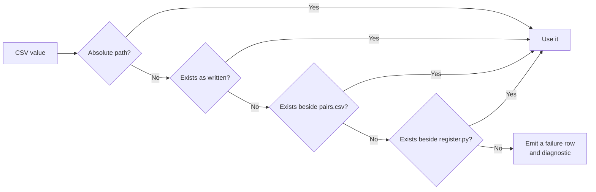

### 4.2 Pose search

V1 receives the scale. V2 must estimate it, so `dense_pose_search` evaluates
nine scales and five rotations. Anti-aliasing and down-scaling are computed once
per scale; only the much smaller template is rotated inside the angle loop.

```text
scale grid    = 8.0, 8.5, 9.0, …, 11.5, 12.0
rotation grid = −6°, −3°, 0°, +3°, +6°
pose count    = 9 × 5 = 45
```

For every pose, V2 computes a full valid ZNCC surface and retains the global
best finite response. That dense search avoids a proposal cap silently dropping
the correct site.

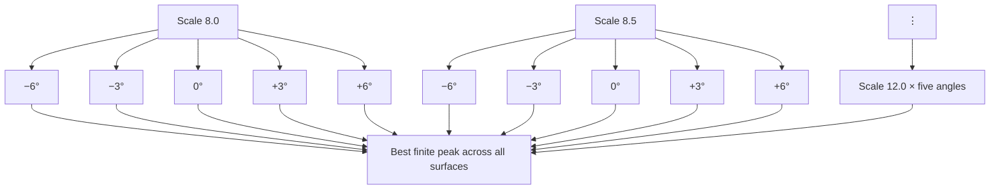

### 4.3 Band-passed matching

Low-frequency charging and brightness drift can dominate raw intensity while
carrying little positional information. V2 applies a Difference-of-Gaussians
response before ZNCC:

```text
band_pass(I) = Gaussian(I, σ=2) − Gaussian(I, σ=8)
```

The measured gain is largest at the hardest severity level.


### 4.4 Full-resolution refinement

The pose grid is intentionally coarse. After site selection, V2 performs three
alternating passes:

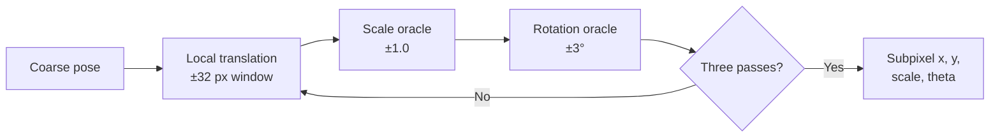

Translation uses a local full-resolution correlation and a parabolic peak fit.
When several periodic peaks are nearly equivalent, the refiner prefers the one
nearest the incoming estimate rather than jumping by a lattice period.

### 4.5 Presence and correctness are different questions

V2 deliberately does not collapse `found` and `score` into one value:

- `found` estimates whether the reference occurs anywhere in the search image.
- `score` estimates whether the reported coordinate is correct.

A reference can be present while the selected lattice copy is wrong. In that
case `found = 1` and a low `score` is coherent and useful.

```mermaid
quadrantChart
    title Presence and coordinate trust
    x-axis Low presence evidence --> High presence evidence
    y-axis Low coordinate trust --> High coordinate trust
    quadrant-1 Present and localized
    quadrant-2 Unusual: verify decision
    quadrant-3 Absent or unusable
    quadrant-4 Present but likely mislocalized
```

### 4.6 Output contract

Every input identifier must appear exactly once in the output.

| Column | Meaning | V2 enforcement |
|---|---|---|
| `pair_id` | Input identity | One output row per unique identifier |
| `x`, `y` | Search-image centre | Finite and clipped to image bounds |
| `theta` | CCW rotation in degrees | Clipped to the disclosed reportable range |
| `scale` | Reference-to-search down-scaling factor | Clipped to `[8, 12]` |
| `found` | Presence flag | Exactly `0` or `1` |
| `score` | Probability coordinate is correct | Finite, on the probability scale |


### 4.7 Runtime and graceful degradation

The dense sweep is the expensive stage. Later stages consult a deadline and can
be skipped when the remaining budget is too small. A valid row is still emitted.

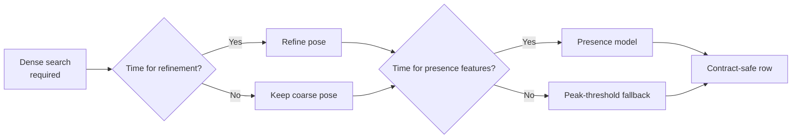

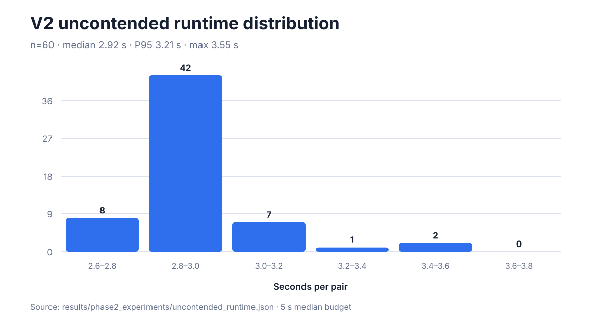

## 5. Measured results

### 5.1 V2 official sample

The tracked aggregate evaluation contains 20 organizer-generated pairs: eight
nominal, six degraded, four absent, and two RGB. It was run once after the
solver was frozen; the file records aggregate metrics and does not reproduce
organizer imagery or coordinates.


| Block | Measurement | Points |
|---|---:|---:|
| Localization | weighted credit `0.9704` | **38.82 / 40** |
| Pose | gated mean credit `0.8656` | **17.31 / 20** |
| Rejection | F1 `0.9412` | **14.12 / 15** |
| Confidence | AUC `0.8889` | **8.89 / 10** |
| RGB | Set D `1.000`, A–C `0.9704` | **+6 bonus** |

Scored subtotal: **79.14 / 85**, before the six-point RGB bonus.

Source: [`results/phase2_experiments/official_sample_evaluation.json`](../results/phase2_experiments/official_sample_evaluation.json)

### 5.2 V1 benchmarks

V1 results come from four named protocols. These are not direct V2 comparisons:
V1 uses known pose and always-present pairs, while V2 solves more outputs under
a different evaluation protocol.


| V1 protocol | Within 5 px | Median error |
|---|---:|---:|
| External development, 120 pairs | 93.33% | 1.44 px |
| External untouched confirmation, 30 pairs | 100.00% | 1.46 px |
| Internal fixed stress, 80 pairs | 48.75% | 62.57 px |
| Internal randomized compliance, 40 pairs | 55.00% | 4.36 px |

Sources: [`external_starter_benchmark.json`](../results/external_starter_benchmark.json),
[`validation_metrics.json`](../results/validation_metrics.json), and
[`evaluation_30plus.json`](../results/evaluation_30plus.json).

### 5.3 Do not mix official and internal V2 numbers

The internal generator renders the reference and search as independent
acquisitions. The organizer sample uses a different acquisition relationship.
The paired experiment below isolates how much that one design choice changes
the internal localization problem.

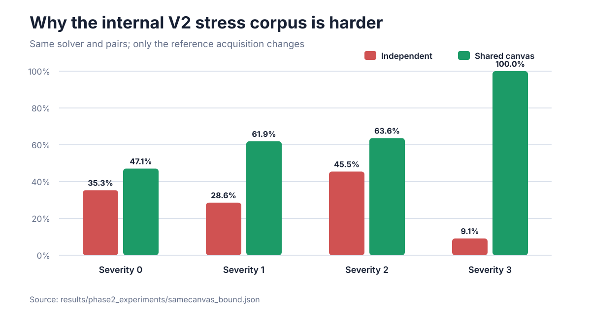

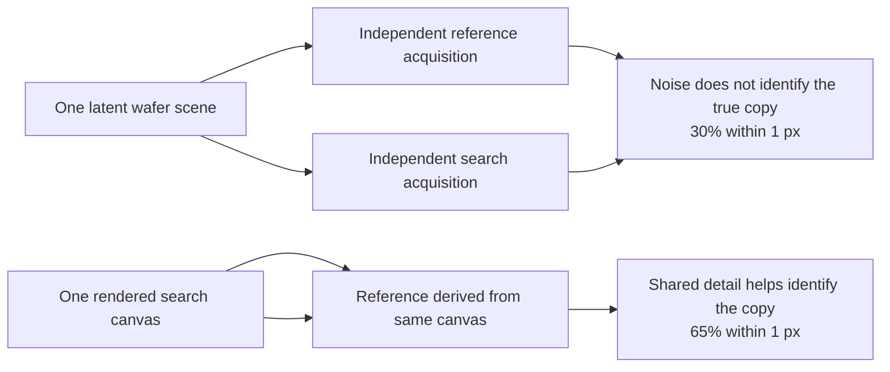

This is why the roughly 30% internal stress result must not be presented as a
forecast of the 97% official localization credit. The protocols answer
different questions.

Source: [`samecanvas_bound.json`](../results/phase2_experiments/samecanvas_bound.json).

## 6. Operational reading of V2 output

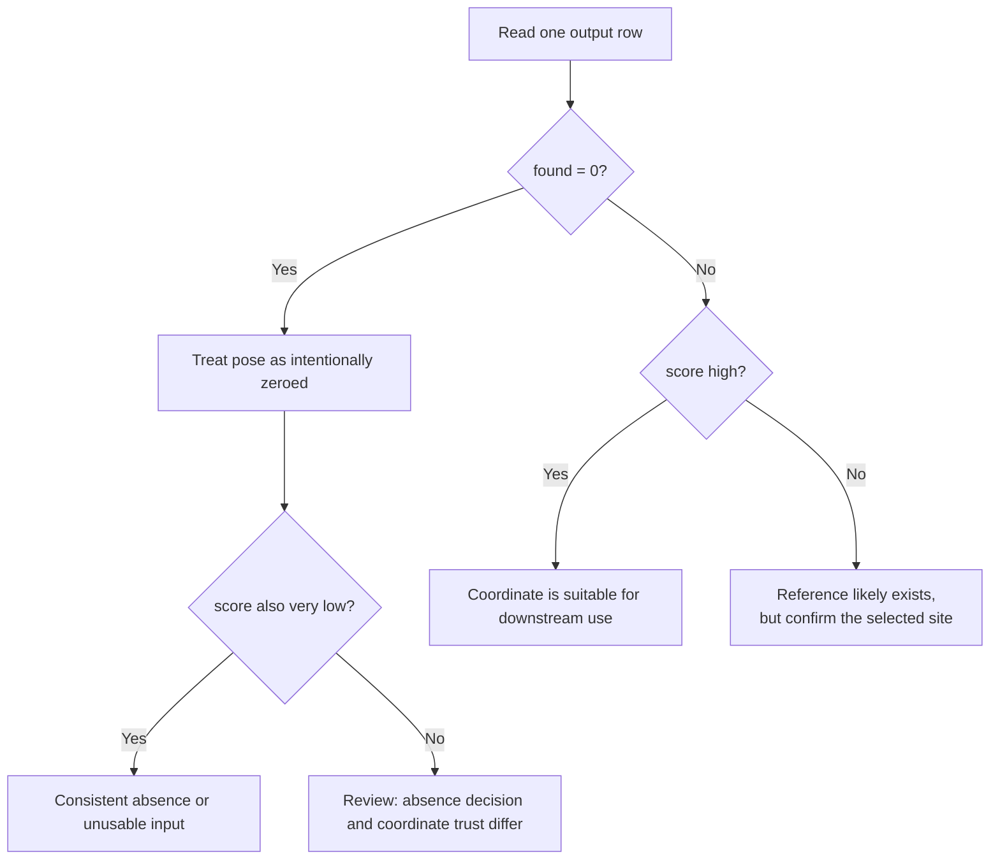

The output should be consumed as two layers:

1. Use `found` for presence/absence workflow.
2. Use `score` to prioritize manual review or downstream automation.

Never infer pose from a `found = 0` row; its pose fields are zero by contract.

## 7. Failure modes and safeguards

| Failure mode | V1 exposure | V2 safeguard |
|---|---|---|
| Wrong working directory | Paths may fail globally | Resolve relative to CSV and package |
| Unsupported or corrupt image | Run may stop | Emit a valid failure row and diagnostic |
| Constant image / invalid ZNCC | Non-finite peak | Reject non-finite evidence |
| Correct site omitted by proposal cap | Candidate recall ceiling | Dense full-image sweep |
| Periodic peak jump during refinement | Whole-period error | Prefer evidence-equivalent peak nearest seed |
| Unknown pose | Outside V1 contract | Search 45 coarse pose hypotheses, then refine |
| Absent reference | Forced false localization | Independent presence decision |
| Low-confidence present pair | Hidden behind a coordinate | Separate correctness score |
| Slow machine | Tail can exceed budget | Deadline-aware stage shedding |
| Internal exception | Missing or malformed output | One contract-safe row per pair |

## 8. Run and verify V2

```bash
python -m pip install --disable-pip-version-check -r requirements.txt
python register.py --input pairs.csv --output predictions.csv
python scripts/audit_phase2_contract.py dist/LatticeRank_Phase2.zip
```

The expected output header is:

```csv
pair_id,x,y,theta,scale,found,score
```

Full repository verification:

```bash
python -m pytest -q
python scripts/verify_evidence.py
python scripts/build_submission.py
```

## 9. Rebuild every chart in this guide

The SVG files are not hand-entered. One standard-library script loads the
tracked evidence JSON and regenerates all six charts:

```bash
python scripts/build_v2_visuals.py
```

Generated files:

- `docs/images/v2_official_scorecard.svg`
- `docs/images/v2_official_sets.svg`
- `docs/images/v1_benchmarks.svg`
- `docs/images/v2_filter_ablation.svg`
- `docs/images/v2_acquisition_gap.svg`
- `docs/images/v2_runtime.svg`

## 10. Documentation map

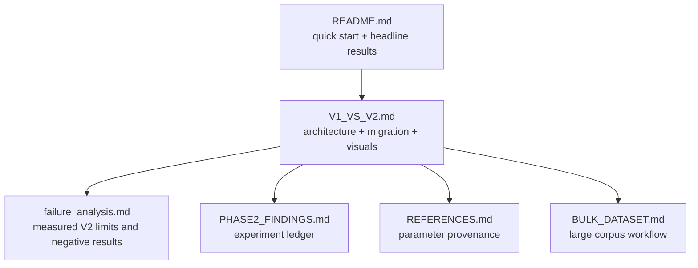

## 11. File-level implementation map

| Area | Main files |
|---|---|
| V2 command-line and contract | `register.py` |
| Deadline and degradation | `driftforge/budget.py` |
| Dense pose sweep | `driftforge/dense.py` |
| Pose conventions and template construction | `driftforge/pose.py` |
| Local pose refinement | `driftforge/refine.py` |
| Presence decision | `driftforge/presence_model.py` |
| Correctness probability | `driftforge/correctness_model.py` |
| V2 synthetic generator | `driftforge/generator.py`, `driftforge/phase2.py` |
| Contract audit | `scripts/audit_phase2_contract.py` |
| Submission packaging | `scripts/build_submission.py` |
| Visual regeneration | `scripts/build_v2_visuals.py` |

## 12. Bottom line

V1 proves the periodic-localization core. V2 turns that core into a bounded,
presence-aware registration product:

```text
V1 = locate(x, y | fixed pose, present)

V2 = decide presence
   + search translation, scale, rotation
   + refine the selected pose
   + estimate coordinate correctness
   + guarantee a valid row under every failure mode
```

The official sample result—**79.14 / 85 scored points plus the RGB bonus**—shows
that the expanded contract works end to end. The internal stress results remain
useful for engineering because they expose the specific acquisition condition
under which periodic site identity becomes the limiting problem.
